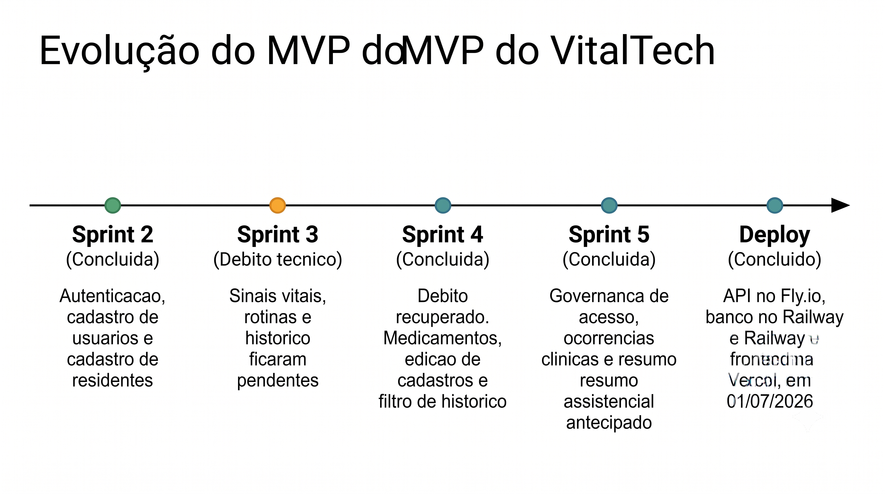

# Planejamento e Organização

Esta página consolida os principais quadros de acompanhamento do VitalTech. Ela não substitui os documentos de visão, requisitos, sprints ou PRs; seu objetivo é servir como ponto de entrada para localizar rapidamente planejamento, evidências, status do MVP, rastreabilidade e prints das User Stories implementadas.

## Síntese do Projeto

| Item | Registro |
| --- | --- |
| Cliente | [Lar dos Velhinhos Bezerra de Menezes](visao/cenario_atual.md#11-identificacao-do-clienteparceiro) |
| Problema central | Registros assistenciais feitos em papel, transcrição posterior para planilhas/Microsoft Access, dificuldade de consulta rápida ao histórico e risco de perda ou atraso de informação. |
| Solução proposta | [VitalTech](visao/solucao_proposta.md), um PWA para registro e consulta assistencial com controle de acesso, persistência local e histórico por residente. |
| Estratégia de Engenharia de Software | [ScrumXP](visao/estrategias_eng_soft.md), com sprints, planning, review, retrospectiva, revisão por pares, testes e incrementos funcionais. |
| Processo de Engenharia de Requisitos | [Processo de ER](visao/eng_requisitos.md), com elicitação, análise, especificação, validação, priorização e rastreabilidade. |
| Critérios de prontidão e conclusão | [DoR e DoD](visao/dor_dod.md), aplicados às User Stories planejadas e entregues. |
| Software disponível | [Aplicação VitalTech](https://frontend-albertos-projects-28fa367e.vercel.app/login?redirect=/residentes) |

## Critérios Cobrados e Onde Estão Evidenciados

| Critério solicitado | Como está evidenciado |
| --- | --- |
| Quadro de planejamento com cronograma e evidências | Seção [Quadro de Planejamento](#quadro-planejamento), com links para cronograma, planning, execução, review, retrospectiva e PRs. |
| Quadro de MVP com evidências e status | Seção [Quadro MVP](#quadro-mvp), com status por User Story, evidência, PR, teste e validação. |
| Rastreabilidade Problema > Objetivos > CPs > RFs > US/CA/UC | Seção [Rastreabilidade](#rastreabilidade), com links para problema, objetivos, características, RFs, RNs, RNFs, critérios de aceitação e casos de uso. |
| Prints por User Story | Seção [US > Protótipo > Aplicação](#prints-us), com imagem e link de aplicação para cada US. |
| Processo ESW e ER com evidências | Quadros de planejamento, sprints, DoR/DoD, reviews, retrospectivas e links para [Engenharia de Software](visao/estrategias_eng_soft.md) e [Engenharia de Requisitos](visao/eng_requisitos.md). |
| Software funcional e disponível | Seção [Software Disponível](#software-disponivel), com frontend publicado, API, Swagger e banco de dados. |
| Feedback do cliente | [Review da Sprint 4](sprints/sprint4/review.md#validacao-do-cliente) e [formulário de validação do cliente](https://docs.google.com/forms/d/1jZYJ1vcGutQ4t1C4xJf9qxUmTCGUxZ5RH_nczJL-CFs/edit?ts=6a301b5f#responses). |

## Quadro de Planejamento: Cronograma + Evidências

O cronograma completo permanece documentado em [Cronograma](visao/cronograma.md). A tabela abaixo resume a execução e aponta para as evidências de cada ciclo.

| Sprint | Período | Objetivo | Status | Evidências principais | Resultado |
| --- | --- | --- | --- | --- | --- |
| Sprint 0 | 31/03 a 02/05 | Compreensão do problema e alinhamento de escopo. | Concluída | [Reunião 1](sprints/sprint0/reuniao1.md), [Reunião 2](sprints/sprint0/reuniao2.md), [Cenário Atual](visao/cenario_atual.md), [Solução Proposta](visao/solucao_proposta.md). | Problema, cliente, contexto e oportunidade definidos. |
| Sprint 1 | 03/05 a 16/05 | Levantamento inicial de requisitos e estruturação do produto. | Concluída | [Planning](sprints/sprint1/planning.md), [Dailys](sprints/sprint1/dailys.md), [Review](sprints/sprint1/review.md), [Retrospectiva](sprints/sprint1/retrospectiva.md). | Base inicial de requisitos, visão do produto e documentação MkDocs. |
| Sprint 2 | 17/05 a 30/05 | Criar a fundação do sistema: login, usuários, residentes e logout. | Concluída | [Planning](sprints/sprint2/planning.md), [Execução](sprints/sprint2/execucao.md), [Review](sprints/sprint2/review.md), [Retrospectiva](sprints/sprint2/retrospectiva.md), [PR #43](https://github.com/mdsreq-fga-unb/REQ-2026.1-T01-VitalTech/pull/43). | US08, US09, US10 e US01 implementadas e evidenciadas. |
| Sprint 3 | 31/05 a 13/06 | Iniciar ciclo assistencial: sinais vitais, rotinas e histórico. | Encerrada com débito técnico | [Planning](sprints/sprint3/planning.md), [Dailys](sprints/sprint3/dailys.md), [Review](sprints/sprint3/review.md), [Retrospectiva](sprints/sprint3/retrospectiva.md). | US04, US05 e US14 foram realocadas para Sprint 4 por falta de incremento funcional concluído no período. |
| Sprint 4 | 14/06 a 27/06 | Recuperar débito da Sprint 3 e consolidar cadastros, medicamentos e filtro de histórico. | Concluída | [Planning](sprints/sprint4/planning.md), [Review](sprints/sprint4/review.md), [Retrospectiva](sprints/sprint4/retrospectiva.md), [PR #83](https://github.com/mdsreq-fga-unb/REQ-2026.1-T01-VitalTech/pull/83), [PR #84](https://github.com/mdsreq-fga-unb/REQ-2026.1-T01-VitalTech/pull/84), [PR #85](https://github.com/mdsreq-fga-unb/REQ-2026.1-T01-VitalTech/pull/85), [PR #90](https://github.com/mdsreq-fga-unb/REQ-2026.1-T01-VitalTech/pull/90), [PR #91](https://github.com/mdsreq-fga-unb/REQ-2026.1-T01-VitalTech/pull/91), [PR #92](https://github.com/mdsreq-fga-unb/REQ-2026.1-T01-VitalTech/pull/92), [PR #93](https://github.com/mdsreq-fga-unb/REQ-2026.1-T01-VitalTech/pull/93). | US04, US05, US14, US11, US02, US06 e US15 concluídas dentro do recorte entregue; para US04 e US05, edição de registros assistenciais fica como evolução posterior. |
| Sprint 5 | 28/06 a 01/07 | Finalizar governança de acesso, inativação, ocorrências clínicas e resumo assistencial. | Concluída tecnicamente | [Planning](sprints/sprint5/planning.md), [Review](sprints/sprint5/review.md), [Retrospectiva](sprints/sprint5/retrospectiva.md), [PR #110](https://github.com/mdsreq-fga-unb/REQ-2026.1-T01-VitalTech/pull/110), [testes de serviços](https://github.com/mdsreq-fga-unb/REQ-2026.1-T01-VitalTech/blob/developer/app/frontend/src/services/__tests__/services.test.js). | US12, US13, US03, US07 e US16 implementadas no código, cobertas por testes automatizados e registradas na Review/Retrospectiva da sprint. |

### Linha do Tempo Visual do MVP

Imagem. Linha do tempo visual da evolução do MVP do VitalTech, consolidando as sprints de concepção, execução, recuperação de débito técnico, fechamento técnico e publicação do sistema.

### Evidências Visuais por Sprint

| Sprint | Evidência visual | Registro textual |
| --- | --- | --- |
| Sprint 0 |  | [Reunião 1](sprints/sprint0/reuniao1.md), [Reunião 2](sprints/sprint0/reuniao2.md), [Cenário Atual](visao/cenario_atual.md) e [Solução Proposta](visao/solucao_proposta.md). |
| Sprint 1 |  | [Planning](sprints/sprint1/planning.md), [Dailys](sprints/sprint1/dailys.md), [Review](sprints/sprint1/review.md) e [Retrospectiva](sprints/sprint1/retrospectiva.md). |
| Sprint 2 |  | [Planning](sprints/sprint2/planning.md), [Execução](sprints/sprint2/execucao.md), [Review](sprints/sprint2/review.md), [Retrospectiva](sprints/sprint2/retrospectiva.md) e [PR #43](https://github.com/mdsreq-fga-unb/REQ-2026.1-T01-VitalTech/pull/43). |
| Sprint 3 |  | [Planning](sprints/sprint3/planning.md), [Dailys](sprints/sprint3/dailys.md), [Review](sprints/sprint3/review.md) e [Retrospectiva](sprints/sprint3/retrospectiva.md). |
| Sprint 4 |  | [Planning](sprints/sprint4/planning.md), [Review](sprints/sprint4/review.md), [Retrospectiva](sprints/sprint4/retrospectiva.md) e PRs [#83](https://github.com/mdsreq-fga-unb/REQ-2026.1-T01-VitalTech/pull/83), [#84](https://github.com/mdsreq-fga-unb/REQ-2026.1-T01-VitalTech/pull/84), [#85](https://github.com/mdsreq-fga-unb/REQ-2026.1-T01-VitalTech/pull/85), [#90](https://github.com/mdsreq-fga-unb/REQ-2026.1-T01-VitalTech/pull/90), [#91](https://github.com/mdsreq-fga-unb/REQ-2026.1-T01-VitalTech/pull/91), [#92](https://github.com/mdsreq-fga-unb/REQ-2026.1-T01-VitalTech/pull/92) e [#93](https://github.com/mdsreq-fga-unb/REQ-2026.1-T01-VitalTech/pull/93). |
| Sprint 5 |  | [Planning](sprints/sprint5/planning.md), [Review](sprints/sprint5/review.md), [Retrospectiva](sprints/sprint5/retrospectiva.md) e [PR #110](https://github.com/mdsreq-fga-unb/REQ-2026.1-T01-VitalTech/pull/110). |

## Evidências do Processo de Execução

| Processo | Evidências |
| --- | --- |
| Scrum: Planning | [Sprint 1](sprints/sprint1/planning.md), [Sprint 2](sprints/sprint2/planning.md), [Sprint 3](sprints/sprint3/planning.md), [Sprint 4](sprints/sprint4/planning.md), [Sprint 5](sprints/sprint5/planning.md). |
| Scrum: Dailys | [Sprint 1](sprints/sprint1/dailys.md), [Sprint 2](sprints/sprint2/dailys.md), [Sprint 3](sprints/sprint3/dailys.md), [Sprint 4](sprints/sprint4/dailys.md), [Sprint 5](sprints/sprint5/dailys.md). |
| Scrum: Review | [Sprint 1](sprints/sprint1/review.md), [Sprint 2](sprints/sprint2/review.md), [Sprint 3](sprints/sprint3/review.md), [Sprint 4](sprints/sprint4/review.md), [Sprint 5](sprints/sprint5/review.md). |
| Scrum: Retrospectiva | [Sprint 1](sprints/sprint1/retrospectiva.md), [Sprint 2](sprints/sprint2/retrospectiva.md), [Sprint 3](sprints/sprint3/retrospectiva.md), [Sprint 4](sprints/sprint4/retrospectiva.md), [Sprint 5](sprints/sprint5/retrospectiva.md). |
| XP: revisão técnica e testes | PRs por entrega, revisão por pares e testes automatizados em [services.test.js](https://github.com/mdsreq-fga-unb/REQ-2026.1-T01-VitalTech/blob/developer/app/frontend/src/services/__tests__/services.test.js). |
| Engenharia de Requisitos | [User Stories](visao/user_stories.md), [Requisitos](visao/requisitos.md), [Story Map](visao/story_map.md), [Matriz de Priorização](visao/priorizacao.md), [DoR/DoD](visao/dor_dod.md). |

## Software Disponível: Deploy e Ambientes

O VitalTech possui frontend publicado, API em produção e documentação automática da API. Esses links complementam as evidências de execução local e demonstram que o produto pode ser acessado fora do ambiente de desenvolvimento.

| Camada | Tecnologia | Evidência |
| --- | --- | --- |
| Frontend | Vue 3, Vite e PWA na Vercel | [Aplicação VitalTech](https://frontend-albertos-projects-28fa367e.vercel.app/login?redirect=/residentes) |
| API | Python e FastAPI no Fly.io | [API VitalTech](https://vitaltech-api-vitaltech.fly.dev) |
| Documentação da API | Swagger gerado pelo FastAPI | [Swagger da API](https://vitaltech-api-vitaltech.fly.dev/docs) |
| Banco de dados | MySQL no Railway | Instância privada acessada pela API. |

### Rotas Principais da API

| Método | Rota | Finalidade |
| :---: | --- | --- |
| POST | `/auth/login` | Autenticar usuário no sistema. |
| POST | `/auth/logout` | Encerrar sessão do usuário. |
| POST | `/usuarios` | Cadastrar novo usuário. |
| GET | `/usuarios` | Listar usuários, com filtro opcional por login. |
| PUT | `/usuarios/{id}` | Atualizar usuário, redefinir senha ou revogar acesso. |
| POST | `/residentes` | Cadastrar novo residente. |
| GET | `/residentes` | Listar residentes, com filtro opcional por CPF. |
| PUT | `/residentes/{id}` | Atualizar ou inativar residente. |
| POST | `/sinaisVitais` | Registrar sinais vitais. |
| GET | `/sinaisVitais` | Consultar sinais vitais. |
| POST | `/rotinasAssistenciais` | Registrar rotinas assistenciais. |
| GET | `/rotinasAssistenciais` | Consultar rotinas assistenciais. |
| POST | `/ocorrencias` | Registrar ocorrência clínica. |
| PUT | `/ocorrencias/{id}` | Editar ocorrência clínica. |
| GET | `/ocorrencias` | Consultar ocorrências clínicas. |

## Quadro MVP: Evidências + Status

  <iframe
    style="border: 1px solid rgba(0, 0, 0, 0.1);"
    width="100%"
    height="700"
    src="https://embed.figma.com/design/6ymSHXkt5iCVia6qbuPFZA/Untitled?node-id=0-1&embed-host=share"
    allowfullscreen>
  </iframe>

O quadro visual acima apresenta a organização do MVP. A tabela abaixo registra o status por User Story com evidências objetivas.

| User Story | Sprint | Status | Evidência visual/processual | PR/Commit | Teste | Validação/observação |
| --- | --- | --- | --- | --- | --- | --- |
| [US08 - Autenticar usuário](visao/user_stories.md#us08) | Sprint 2 | Concluída | [Execução Sprint 2](sprints/sprint2/execucao.md), [Review Sprint 2](sprints/sprint2/review.md), [print US08](#print-us08). | [PR #43](https://github.com/mdsreq-fga-unb/REQ-2026.1-T01-VitalTech/pull/43) | Testes de autenticação e regressão da Sprint 2. | Login válido, erro genérico e bloqueio de rota sem sessão. |
| [US09 - Encerrar sessão](visao/user_stories.md#us09) | Sprint 2 | Concluída | [Review Sprint 2](sprints/sprint2/review.md), [print US09](#print-us09). | [PR #43](https://github.com/mdsreq-fga-unb/REQ-2026.1-T01-VitalTech/pull/43) | Testes de sessão e logout. | Logout, limpeza de sessão e redirecionamento. |
| [US10 - Cadastrar usuário](visao/user_stories.md#us10) | Sprint 2 | Concluída | [Execução Sprint 2](sprints/sprint2/execucao.md), [print US10](#print-us10). | [PR #43](https://github.com/mdsreq-fga-unb/REQ-2026.1-T01-VitalTech/pull/43) | Testes de cadastro e login de usuário recém-criado. | Cadastro de usuário com backend mock e IndexedDB. |
| [US01 - Cadastrar residente](visao/user_stories.md#us01) | Sprint 2 | Concluída | [Execução Sprint 2](sprints/sprint2/execucao.md), [print US01](#print-us01). | [PR #43](https://github.com/mdsreq-fga-unb/REQ-2026.1-T01-VitalTech/pull/43) | Testes de campos obrigatórios e CPF duplicado. | Cadastro de residente com foto e dados básicos. |
| [US04 - Sinais vitais](visao/user_stories.md#us04) | Sprint 3 > Sprint 4 | Concluída no recorte MVP | [Review Sprint 3](sprints/sprint3/review.md), [Planning Sprint 4](sprints/sprint4/planning.md), [Review Sprint 4](sprints/sprint4/review.md), [print US04](#print-us04). | [PR #83](https://github.com/mdsreq-fga-unb/REQ-2026.1-T01-VitalTech/pull/83), [PR #85](https://github.com/mdsreq-fga-unb/REQ-2026.1-T01-VitalTech/pull/85) | Testes de persistência e build registrados nos PRs. | O recorte final do MVP cobriu registro, persistência, validação e consulta via histórico; edição de registros assistenciais permanece como evolução posterior. |
| [US05 - Rotinas assistenciais](visao/user_stories.md#us05) | Sprint 3 > Sprint 4 | Concluída no recorte MVP | [Review Sprint 3](sprints/sprint3/review.md), [Planning Sprint 4](sprints/sprint4/planning.md), [Review Sprint 4](sprints/sprint4/review.md), [print US05](#print-us05). | [PR #83](https://github.com/mdsreq-fga-unb/REQ-2026.1-T01-VitalTech/pull/83), [PR #84](https://github.com/mdsreq-fga-unb/REQ-2026.1-T01-VitalTech/pull/84), [PR #85](https://github.com/mdsreq-fga-unb/REQ-2026.1-T01-VitalTech/pull/85) | Testes de persistência e validação manual registrados nos PRs. | O recorte final do MVP cobriu registro, persistência, validação e consulta via histórico; edição de registros assistenciais permanece como evolução posterior. |
| [US14 - Histórico assistencial](visao/user_stories.md#us14) | Sprint 3 > Sprint 4 | Concluída | [Review Sprint 4](sprints/sprint4/review.md), [print US14](#print-us14). | [PR #83](https://github.com/mdsreq-fga-unb/REQ-2026.1-T01-VitalTech/pull/83), [PR #85](https://github.com/mdsreq-fga-unb/REQ-2026.1-T01-VitalTech/pull/85) | Testes do `assistenciaService` para histórico por residente. | PR específico #82 foi fechado; entrega absorvida por PRs integrados da Sprint 4. |
| [US11 - Atualizar usuário](visao/user_stories.md#us11) | Sprint 4 | Concluída | [Review Sprint 4](sprints/sprint4/review.md), [print US11](#print-us11). | [PR #90](https://github.com/mdsreq-fga-unb/REQ-2026.1-T01-VitalTech/pull/90), [PR #93](https://github.com/mdsreq-fga-unb/REQ-2026.1-T01-VitalTech/pull/93) | Testes e build registrados nos PRs. | Validação de campos, permissão e preservação de dados. |
| [US02 - Editar residente](visao/user_stories.md#us02) | Sprint 4 | Concluída | [Review Sprint 4](sprints/sprint4/review.md), [print US02](#print-us02). | [PR #90](https://github.com/mdsreq-fga-unb/REQ-2026.1-T01-VitalTech/pull/90), [PR #93](https://github.com/mdsreq-fga-unb/REQ-2026.1-T01-VitalTech/pull/93) | Testes e build registrados nos PRs. | Edição de residente preservando vínculos e dados existentes. |
| [US06 - Medicamentos](visao/user_stories.md#us06) | Sprint 4 | Concluída | [Review Sprint 4](sprints/sprint4/review.md), [print US06](#print-us06). | [PR #91](https://github.com/mdsreq-fga-unb/REQ-2026.1-T01-VitalTech/pull/91) | Testes unitários, build e validação local registrados no PR. | Registro de administração/não administração integrado ao fluxo assistencial. |
| [US15 - Filtrar histórico](visao/user_stories.md#us15) | Sprint 4 | Concluída | [Review Sprint 4](sprints/sprint4/review.md), [print US15](#print-us15). | [PR #92](https://github.com/mdsreq-fga-unb/REQ-2026.1-T01-VitalTech/pull/92) | Testes e build registrados no PR. | Filtro por período integrado ao histórico. |
| [US12 - Redefinir senha](visao/user_stories.md#us12) | Sprint 5 | Concluída | [Planning Sprint 5](sprints/sprint5/planning.md), [print US12](#print-us12). | [PR #110](https://github.com/mdsreq-fga-unb/REQ-2026.1-T01-VitalTech/pull/110) | [Teste US12](https://github.com/mdsreq-fga-unb/REQ-2026.1-T01-VitalTech/blob/developer/app/frontend/src/services/__tests__/services.test.js#L1167). | Senha antiga rejeitada, nova senha aceita e perfil sem permissão bloqueado. |
| [US13 - Revogar acesso](visao/user_stories.md#us13) | Sprint 5 | Concluída | [Planning Sprint 5](sprints/sprint5/planning.md), [print US13](#print-us13). | [PR #110](https://github.com/mdsreq-fga-unb/REQ-2026.1-T01-VitalTech/pull/110) | [Teste US13](https://github.com/mdsreq-fga-unb/REQ-2026.1-T01-VitalTech/blob/developer/app/frontend/src/services/__tests__/services.test.js#L1198). | Usuário inativo não gera nova sessão e registros históricos são preservados. |
| [US03 - Inativar residente](visao/user_stories.md#us03) | Sprint 5 | Concluída | [Planning Sprint 5](sprints/sprint5/planning.md), [print US03](#print-us03). | [PR #110](https://github.com/mdsreq-fga-unb/REQ-2026.1-T01-VitalTech/pull/110) | [Teste US03](https://github.com/mdsreq-fga-unb/REQ-2026.1-T01-VitalTech/blob/developer/app/frontend/src/services/__tests__/services.test.js#L1235). | Residente inativo sai da lista operacional e histórico é preservado. |
| [US07 - Ocorrências clínicas](visao/user_stories.md#us07) | Sprint 5 | Concluída | [Planning Sprint 5](sprints/sprint5/planning.md), [print US07](#print-us07). | [PR #110](https://github.com/mdsreq-fga-unb/REQ-2026.1-T01-VitalTech/pull/110) | [Teste US07](https://github.com/mdsreq-fga-unb/REQ-2026.1-T01-VitalTech/blob/developer/app/frontend/src/services/__tests__/services.test.js#L1265). | Registro, consulta, edição, rastreabilidade e sinalização de notificação. |
| [US16 - Resumo assistencial](visao/user_stories.md#us16) | Sprint 5 | Concluída | [Planning Sprint 5](sprints/sprint5/planning.md), [print US16](#print-us16). | [PR #110](https://github.com/mdsreq-fga-unb/REQ-2026.1-T01-VitalTech/pull/110) | [Teste US16](https://github.com/mdsreq-fga-unb/REQ-2026.1-T01-VitalTech/blob/developer/app/frontend/src/services/__tests__/services.test.js#L1355). | Consolidação do último registro por módulo e estados vazios explícitos. |

> **Observação de escopo:** A US04 e a US05 foram mantidas com a numeração original para preservar a rastreabilidade com RF04, RF05, critérios de aceite, Story Map, cronograma e PRs. Para o MVP final, a equipe considerou concluído o recorte de registro, persistência, validação e consulta via histórico. A edição de registros assistenciais permanece documentada como evolução posterior.

## Rastreabilidade: Problema > Objetivos > Características > RFs > US/CA

  <iframe
    style="border: 1px solid rgba(0, 0, 0, 0.1);"
    width="100%"
    height="700"
    src="https://embed.figma.com/design/cYngHqkky6tNZR9Y6jNBro/Untitled?node-id=0-1&embed-host=share"
    allowfullscreen>
  </iframe>

O quadro visual acima apresenta a hierarquia do Figma. A tabela abaixo registra a rastreabilidade clicável conforme a documentação oficial do repositório.

| Problema/Oportunidade | Objetivo | Característica de Produto | RFs | US e Critérios de Aceitação |
| --- | --- | --- | --- | --- |
| [Registros manuais, retrabalho e dificuldade de acompanhamento preventivo](visao/cenario_atual.md#14-identificacao-da-oportunidade-ou-problema). | [OE1 - Centralizar o registro assistencial](visao/solucao_proposta.md#22-objetivos-especificos-oe-do-produto). | [CP1 - Gestão de Residentes](visao/solucao_proposta.md#23-caracteristicas-de-produto). | [RF01](visao/requisitos.md#rf01), [RF02](visao/requisitos.md#rf02), [RF03](visao/requisitos.md#rf03). | [US01 / CA01](visao/user_stories.md#us01), [US02 / CA02](visao/user_stories.md#us02), [US03 / CA03](visao/user_stories.md#us03). |
| [Coleta em papel no ponto de cuidado e transcrição posterior](visao/cenario_atual.md#14-identificacao-da-oportunidade-ou-problema). | [OE1 - Centralizar o registro assistencial](visao/solucao_proposta.md#22-objetivos-especificos-oe-do-produto). | [CP2 - Registro Assistencial Digital](visao/solucao_proposta.md#23-caracteristicas-de-produto). | [RF04](visao/requisitos.md#rf04), [RF05](visao/requisitos.md#rf05), [RF06](visao/requisitos.md#rf06), [RF07](visao/requisitos.md#rf07). | [US04 / CA04](visao/user_stories.md#us04), [US05 / CA05](visao/user_stories.md#us05), [US06 / CA06](visao/user_stories.md#us06), [US07 / CA07](visao/user_stories.md#us07). |
| Necessidade de proteger dados sensíveis e evitar uso indevido em dispositivo compartilhado. | [OE2 - Garantir controle de acesso e rastreabilidade](visao/solucao_proposta.md#22-objetivos-especificos-oe-do-produto). | [CP3 - Autenticação de Usuários](visao/solucao_proposta.md#23-caracteristicas-de-produto). | [RF08](visao/requisitos.md#rf08), [RF09](visao/requisitos.md#rf09). | [US08 / CA08](visao/user_stories.md#us08), [US09 / CA09](visao/user_stories.md#us09). |
| Alta rotatividade da equipe e necessidade de controle administrativo sobre acessos. | [OE2 - Garantir controle de acesso e rastreabilidade](visao/solucao_proposta.md#22-objetivos-especificos-oe-do-produto). | [CP4 - Gerenciamento de Usuários](visao/solucao_proposta.md#23-caracteristicas-de-produto). | [RF10](visao/requisitos.md#rf10), [RF11](visao/requisitos.md#rf11), [RF12](visao/requisitos.md#rf12), [RF13](visao/requisitos.md#rf13). | [US10 / CA10](visao/user_stories.md#us10), [US11 / CA11](visao/user_stories.md#us11), [US12 / CA12](visao/user_stories.md#us12), [US13 / CA13](visao/user_stories.md#us13). |
| Histórico assistencial lento de consultar, dificultando continuidade do cuidado e decisão clínica. | [OE3 - Apoiar a tomada de decisão clínica](visao/solucao_proposta.md#22-objetivos-especificos-oe-do-produto). | [CP5 - Consulta do Histórico Assistencial](visao/solucao_proposta.md#23-caracteristicas-de-produto). | [RF14](visao/requisitos.md#rf14), [RF15](visao/requisitos.md#rf15), [RF16](visao/requisitos.md#rf16). | [US14 / CA14](visao/user_stories.md#us14), [US15 / CA15](visao/user_stories.md#us15), [US16 / CA16](visao/user_stories.md#us16). |

### Regras e RNFs Transversais

| Tipo | Evidência |
| --- | --- |
| Regras de negócio | [RN-01 a RN-09](visao/requisitos.md#rn-01), com destaque para operação offline, preservação de histórico, campos obrigatórios, validação clínica e confirmação de salvamento. |
| Requisitos não funcionais | [RNF01 a RNF16](visao/requisitos.md#rnf01), cobrindo integridade, usabilidade, desempenho, rastreabilidade, sessão, permissões e legibilidade do histórico. |
| Matriz operacional | [Matriz US > RF > RN > RNF > CA](visao/requisitos.md#41-matriz-operacional-de-rastreabilidade). |
| Story Map | [Story Map](visao/story_map.md), com organização por jornada, característica de produto, sprint e status de execução. |
| Casos de uso | [Especificação de Casos de Uso](visao/casos_de_uso.md), derivada dos RFs e das características de produto. |

## US > Protótipo > Aplicação

As imagens abaixo foram adicionadas para evidenciar a ligação entre User Story, protótipo/tela e aplicação. A numeração usada nos títulos segue a lista oficial de [User Stories](visao/user_stories.md).

### US01 - Cadastrar dados do residente

- **RF relacionado:** [RF01](visao/requisitos.md#rf01)
- **Critérios de aceitação:** [CA01.1 a CA01.3](visao/user_stories.md#us01)
- **Aplicação:** [Cadastro de residente](https://frontend-albertos-projects-28fa367e.vercel.app/cadastro)

### US02 - Editar dados pessoais e clínicos do residente

- **RF relacionado:** [RF02](visao/requisitos.md#rf02)
- **Critérios de aceitação:** [CA02.1 a CA02.4](visao/user_stories.md#us02)
- **Aplicação:** [Editar residente](https://frontend-albertos-projects-28fa367e.vercel.app/editar-residente/api_res_1)

### US03 - Inativar o cadastro do residente

- **RF relacionado:** [RF03](visao/requisitos.md#rf03)
- **Critérios de aceitação:** [CA03.1 e CA03.2](visao/user_stories.md#us03)
- **Aplicação:** [Lista de residentes](https://frontend-albertos-projects-28fa367e.vercel.app/residentes)

### US04 - Registrar, editar e consultar sinais vitais do residente

- **RF relacionado:** [RF04](visao/requisitos.md#rf04)
- **Critérios de aceitação:** [CA04.1 a CA04.6](visao/user_stories.md#us04)
- **Aplicação:** [Registro assistencial](https://frontend-albertos-projects-28fa367e.vercel.app/residentes)

### US05 - Registrar, editar e consultar rotinas assistenciais do residente

- **RF relacionado:** [RF05](visao/requisitos.md#rf05)
- **Critérios de aceitação:** [CA05.1 a CA05.5](visao/user_stories.md#us05)
- **Aplicação:** [Registro assistencial](https://frontend-albertos-projects-28fa367e.vercel.app/residentes)

### US06 - Registrar, editar e consultar administração de medicamentos

- **RF relacionado:** [RF06](visao/requisitos.md#rf06)
- **Critérios de aceitação:** [CA06.1 a CA06.6](visao/user_stories.md#us06)
- **Aplicação:** [Registro assistencial](https://frontend-albertos-projects-28fa367e.vercel.app/residentes)

### US07 - Registrar, editar e consultar ocorrências clínicas do residente

- **RF relacionado:** [RF07](visao/requisitos.md#rf07)
- **Critérios de aceitação:** [CA07.1 a CA07.6](visao/user_stories.md#us07)
- **Aplicação:** [Registro assistencial](https://frontend-albertos-projects-28fa367e.vercel.app/residentes)

### US08 - Autenticar usuário no sistema

- **RF relacionado:** [RF08](visao/requisitos.md#rf08)
- **Critérios de aceitação:** [CA08.1 a CA08.3](visao/user_stories.md#us08)
- **Aplicação:** [Login](https://frontend-albertos-projects-28fa367e.vercel.app/login?redirect=/residentes)

### US09 - Encerrar sessão do usuário

- **RF relacionado:** [RF09](visao/requisitos.md#rf09)
- **Critérios de aceitação:** [CA09.1 a CA09.3](visao/user_stories.md#us09)
- **Aplicação:** [Painel após autenticação](https://frontend-albertos-projects-28fa367e.vercel.app/residentes)

### US10 - Cadastrar usuário

- **RF relacionado:** [RF10](visao/requisitos.md#rf10)
- **Critérios de aceitação:** [CA10.1 a CA10.4](visao/user_stories.md#us10)
- **Aplicação:** [Cadastro de usuário](https://frontend-albertos-projects-28fa367e.vercel.app/cadastro)

### US11 - Atualizar dados cadastrais do usuário

- **RF relacionado:** [RF11](visao/requisitos.md#rf11)
- **Critérios de aceitação:** [CA11.1 a CA11.4](visao/user_stories.md#us11)
- **Aplicação:** [Editar usuário](https://frontend-albertos-projects-28fa367e.vercel.app/editar-usuario/api_usr_2)

### US12 - Redefinir senha de acesso do usuário

- **RF relacionado:** [RF12](visao/requisitos.md#rf12)
- **Critérios de aceitação:** [CA12.1 a CA12.3](visao/user_stories.md#us12)
- **Aplicação:** [Lista de usuários](https://frontend-albertos-projects-28fa367e.vercel.app/usuarios)

### US13 - Revogar acesso do usuário

- **RF relacionado:** [RF13](visao/requisitos.md#rf13)
- **Critérios de aceitação:** [CA13.1 a CA13.3](visao/user_stories.md#us13)
- **Aplicação:** [Lista de usuários](https://frontend-albertos-projects-28fa367e.vercel.app/usuarios)

### US14 - Consultar histórico de registros do residente

- **RF relacionado:** [RF14](visao/requisitos.md#rf14)
- **Critérios de aceitação:** [CA14.1 a CA14.4](visao/user_stories.md#us14)
- **Aplicação:** [Histórico assistencial](https://frontend-albertos-projects-28fa367e.vercel.app/residentes)

### US15 - Filtrar histórico por período

- **RF relacionado:** [RF15](visao/requisitos.md#rf15)
- **Critérios de aceitação:** [CA15.1 a CA15.3](visao/user_stories.md#us15)
- **Aplicação:** [Histórico assistencial](https://frontend-albertos-projects-28fa367e.vercel.app/residentes)

### US16 - Visualizar resumo assistencial do residente

- **RF relacionado:** [RF16](visao/requisitos.md#rf16)
- **Critérios de aceitação:** [CA16.1 a CA16.3](visao/user_stories.md#us16)
- **Aplicação:** [Resumo assistencial](https://frontend-albertos-projects-28fa367e.vercel.app/residentes)

## Pendências Técnicas Explícitas

| Item | Situação |
| --- | --- |
| RN-01 e RNF09 | A sincronização automática completa e o indicador visual de estado de sincronização ainda precisam ser evoluídos. O registro atual preserva dados localmente em cenários de falha, mas a fila completa de reenvio e transparência visual seguem como melhoria técnica. |
| US04 e US05 | Concluídas no recorte do MVP: registro, persistência, validação e consulta via histórico. A edição de registros assistenciais permanece registrada como evolução posterior. |

## Histórico de Revisão

| Data | Versão | Descrição | Autor |
| :---: | :---: | --- | --- |
| 01/07/2026 | 1.0 | Consolidação do quadro de planejamento, MVP, rastreabilidade e prints por User Story em página única de Planejamento e Organização. | Equipe VitalTech |
| 02/07/2026 | 1.1 | Ajuste do status de US04 e US05 para concluídas no recorte do MVP, mantendo edição de registros assistenciais como evolução posterior. | Enzo Menali |
| 02/07/2026 | 1.2 | Alinhamento da Sprint 5 com Review, Retrospectiva, PR #110 e testes automatizados. | Enzo Menali |
| 02/07/2026 | 1.3 | Inclusão das evidências visuais das sprints e da seção de software disponível com frontend, API e Swagger. | Enzo Menali |
