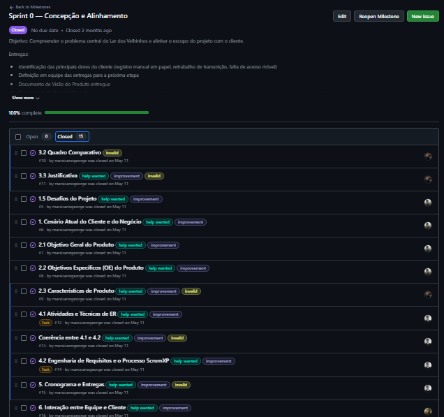
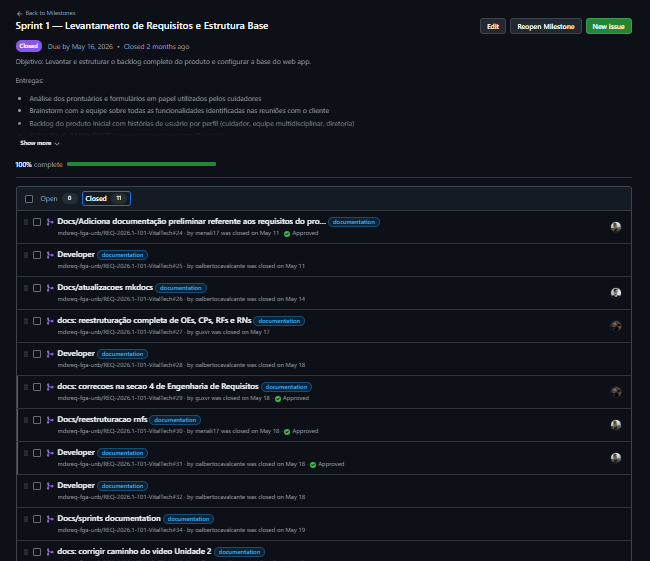
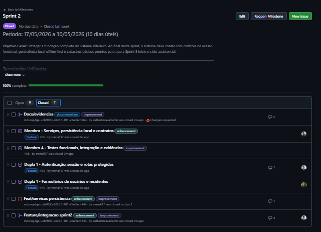
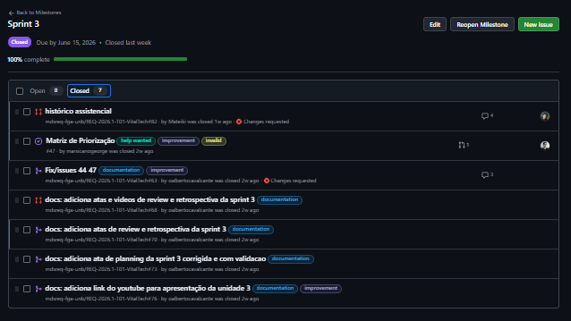
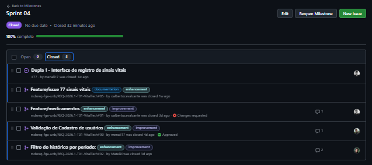
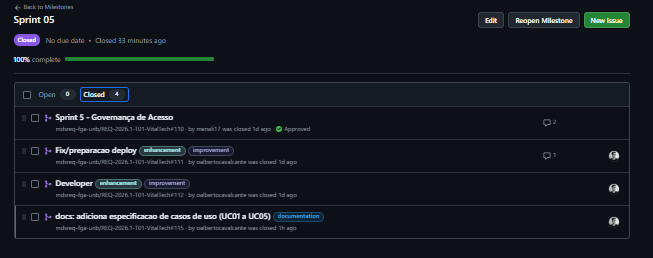

# Mapa de Rastreabilidade

Este mapa apresenta a hierarquia entre Características de Produto, Requisitos e Histórias de Usuário do Vitaltech.

  <iframe
    style="border: 1px solid rgba(0, 0, 0, 0.1);"
    width="100%"
    height="700"
    src="https://embed.figma.com/design/cYngHqkky6tNZR9Y6jNBro/Untitled?node-id=0-1&embed-host=share"
    allowfullscreen>
  </iframe>

# US -> Protótipo -> Aplicação

### US01 - Autenticar acesso

[https://frontend-albertos-projects-28fa367e.vercel.app/login?redirect=/residentes](https://frontend-albertos-projects-28fa367e.vercel.app/login?redirect=/residentes)

### US02 - Encerrar sessão

[https://frontend-albertos-projects-28fa367e.vercel.app/residentes](https://frontend-albertos-projects-28fa367e.vercel.app/residentes)

### US03 - Cadastrar novos usuários

[https://frontend-albertos-projects-28fa367e.vercel.app/cadastro](https://frontend-albertos-projects-28fa367e.vercel.app/cadastro)

### US04 - Atualizar dados cadastrais

[https://frontend-albertos-projects-28fa367e.vercel.app/editar-usuario/api_usr_2](https://frontend-albertos-projects-28fa367e.vercel.app/editar-usuario/api_usr_2)

### US05 - Redefinir senha de acesso

[https://frontend-albertos-projects-28fa367e.vercel.app/usuarios](https://frontend-albertos-projects-28fa367e.vercel.app/usuarios)

### US06 - Revogar acesso do usuário

[https://frontend-albertos-projects-28fa367e.vercel.app/usuarios](https://frontend-albertos-projects-28fa367e.vercel.app/usuarios)

### US07 - Cadastrar novo residente

[https://frontend-albertos-projects-28fa367e.vercel.app/cadastro](https://frontend-albertos-projects-28fa367e.vercel.app/cadastro)

### US08 - Editar dados do residente

[https://frontend-albertos-projects-28fa367e.vercel.app/editar-residente/api_res_1](https://frontend-albertos-projects-28fa367e.vercel.app/editar-residente/api_res_1)

### US09 - Inativar residente

[https://frontend-albertos-projects-28fa367e.vercel.app/residentes](https://frontend-albertos-projects-28fa367e.vercel.app/residentes)

### US10 - Registar rotinas de alimentação/higiene

[https://frontend-albertos-projects-28fa367e.vercel.app/residentes](https://frontend-albertos-projects-28fa367e.vercel.app/residentes)

### US11 - Registar sinais vitais

[https://frontend-albertos-projects-28fa367e.vercel.app/residentes](https://frontend-albertos-projects-28fa367e.vercel.app/residentes)

### US12 - Registar administração de medicamentos

[https://frontend-albertos-projects-28fa367e.vercel.app/residentes](https://frontend-albertos-projects-28fa367e.vercel.app/residentes)

### US13 - Registar ocorrências clínicas

[https://frontend-albertos-projects-28fa367e.vercel.app/residentes](https://frontend-albertos-projects-28fa367e.vercel.app/residentes)

### US14 - Consultar histórico cronológico

[https://frontend-albertos-projects-28fa367e.vercel.app/residentes](https://frontend-albertos-projects-28fa367e.vercel.app/residentes)

### US15 - Filtrar histórico por período:

[https://frontend-albertos-projects-28fa367e.vercel.app/residentes](https://frontend-albertos-projects-28fa367e.vercel.app/residentes)

### US16 - Visualizar resumo consolidado:

[https://frontend-albertos-projects-28fa367e.vercel.app/residentes](https://frontend-albertos-projects-28fa367e.vercel.app/residentes)

# Planejamento

Esta seção apresenta a síntese da execução de cada sprint do projeto
VitalTech, da concepção inicial até a entrega do MVP. Para o status
detalhado de cada User Story e a linha do tempo consolidada da
evolução do MVP, veja a seção
[Andamento do MVP](visao/priorizacao.md#11-andamento-do-mvp), no
documento de Priorização de Requisitos.

### Sprint 0

De 31 de março a 2 de maio de 2026. Concepção e alinhamento do escopo
com o cliente. A equipe realizou entrevistas semiestruturadas com o
diretor voluntário Marcelo Souza, levantou as principais dores da
instituição, entre elas o registro manual em papel, o retrabalho de
transcrição para o Access e a falta de acesso móvel, e elaborou o
Diagrama de Ishikawa e o Documento de Visão do Produto.

### Sprint 1

De 3 a 16 de maio de 2026. Levantamento do backlog completo do produto
e estruturação da base do projeto. Foram analisados os formulários em
papel usados pelos cuidadores, realizado um brainstorm de
funcionalidades, escritas as primeiras histórias de usuário, aplicada
uma priorização inicial e configurada a base do aplicativo web
progressivo, incluindo repositório, ambiente de desenvolvimento e a
rota inicial funcionando no navegador do tablet.

### Sprint 2

De 17 a 30 de maio de 2026. Entrega da fundação do sistema:
autenticação de usuário (US08), encerramento de sessão com proteção
contra inatividade (US09), cadastro de usuário pelo gestor (US10) e
cadastro de residente (US01). Toda a entrega foi consolidada no PR
#43, incluindo testes unitários da camada de serviços e da persistência
local em IndexedDB, por meio da biblioteca Dexie.js.

### Sprint 3

De 31 de maio a 15 de junho de 2026. Diferente das sprints anteriores,
esta não teve o mesmo nível de documentação formal de planning e
review no momento da execução, e foi encerrada com débito técnico nas
histórias de sinais vitais, rotinas assistenciais e consulta ao
histórico. Esse débito foi formalmente reconhecido e corrigido no PR
#81, e as atas de planning, review e retrospectiva foram documentadas
posteriormente, nos PRs #63, #70 e #73.

### Sprint 4

Recuperação integral do débito técnico da Sprint 3 e entrega de:
persistência dos registros assistenciais (PR #83), interface de
rotinas assistenciais (PR #84), interface de sinais vitais, referente
à issue #77 (PR #85), validação da edição de cadastro de usuário (PR
#90), administração de medicamentos, referente à issue #88 (PR #91),
filtro do histórico por período (PR #92) e edição de cadastro de
residente (PR #93).

### Sprint 5

Entrega da governança de acesso: redefinição de senha, revogação de
acesso e registro de ocorrências clínicas, além da antecipação do
resumo assistencial do residente, que estava originalmente planejado
apenas para a Sprint 6. Toda a entrega foi consolidada no PR #110.

# Quadro MVP

  <iframe
    style="border: 1px solid rgba(0, 0, 0, 0.1);"
    width="100%"
    height="700"
    src="https://embed.figma.com/design/6ymSHXkt5iCVia6qbuPFZA/Untitled?node-id=0-1&embed-host=share"
    allowfullscreen>
  </iframe>

