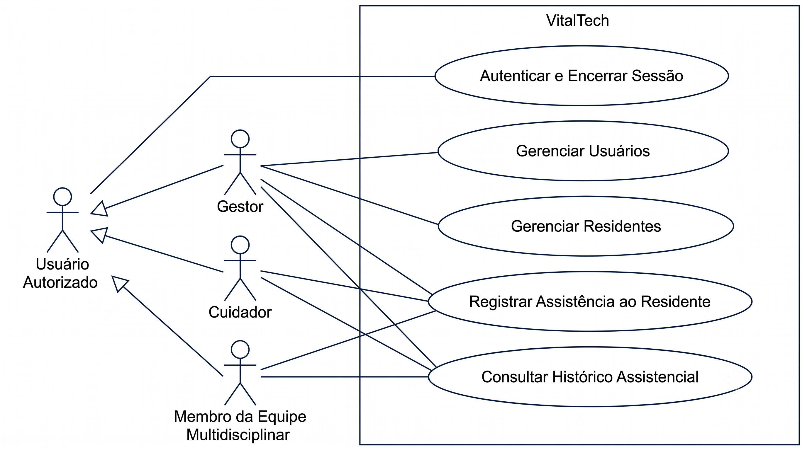

# Especificação de Casos de Uso do VitalTech

Este documento apresenta a Especificação de Casos de Uso do VitalTech.
Ela foi derivada diretamente dos Requisitos Funcionais, das Regras de
Negócio e dos Requisitos Não Funcionais já consolidados em
[Lista de Requisitos](requisitos.md) e em
[User Stories e Critérios de Aceitação](user_stories.md). Os Casos de
Uso foram organizados por Característica de Produto, mantendo a
rastreabilidade que o projeto já usa entre Característica de Produto,
Requisito Funcional e User Story.

## Nota sobre a organização dos Casos de Uso

Os Casos de Uso deste documento foram pensados no nível de objetivo do
usuário, ou seja, cada um representa uma interação completa entre o
ator e o sistema, e não uma ação isolada por Requisito Funcional. Essa
é a prática recomendada de modelagem de Casos de Uso. Um único caso de
uso pode reunir mais de uma ação relacionada do mesmo ator, desde que
represente um objetivo único e contínuo. Por exemplo, um caso de uso
chamado "Efetuar Matrícula" pode cobrir tanto a matrícula em si quanto
a consulta ao registro dessa matrícula, já que fazem parte do mesmo
objetivo do ator no mesmo contexto de uso.

Por esse motivo, os 16 Requisitos Funcionais do VitalTech foram
reunidos em 5 Casos de Uso, um para cada Característica de Produto
(de CP1 a CP5), já definidas em
[Lista de Requisitos](requisitos.md#1-relação-de-requisitos-funcionais-rfs-com-as-características-do-produto-cp).
Cada Requisito Funcional já nasce ligado a exatamente uma Característica
de Produto, e as ações de uma mesma Característica de Produto
representam, na prática, a mesma jornada do ator. Por exemplo,
cadastrar, editar e inativar um residente são etapas do mesmo objetivo
do Gestor, que é cuidar do ciclo de vida do residente dentro do
sistema. Essa organização preserva totalmente a rastreabilidade entre
Característica de Produto, Requisito Funcional, Regra de Negócio e
User Story, já que cada fluxo, seja ele básico, alternativo ou de
exceção, cita o código do requisito correspondente.

## Diagrama de Casos de Uso

Imagem. Esta imagem mostra o diagrama de casos de uso do sistema
VitalTech, representando os perfis de usuário (Gestor, Cuidador e
Membro da Equipe Multidisciplinar) e as principais funcionalidades que
cada um deles pode utilizar no sistema. Criação própria.

---

## UC01. Autenticar e Encerrar Sessão no Sistema

Característica de Produto: CP3, Autenticação de Usuários.
Requisitos Funcionais: RF08 e RF09.
User Stories: US08 e US09.
Atores: Usuário Autorizado, representado pelos perfis Gestor, Cuidador
e Membro da Equipe Multidisciplinar.

### Breve descrição
Permite que um usuário autorizado acesse o sistema por meio de
credenciais individuais (login e senha) e encerre sua sessão ao final
do uso, garantindo que dispositivos compartilhados não fiquem com
sessões abertas indevidamente.

### Pré-condições
O usuário já possui um cadastro ativo no sistema. Veja o UC02, Gerenciar
Usuários.

### Fluxo básico: efetuar login
1. O usuário acessa a tela de login do sistema.
2. O usuário informa login e senha.
3. O sistema valida as credenciais informadas.
4. O sistema autentica o usuário e o direciona para a tela inicial
   correspondente ao seu perfil, que pode ser Gestor, Cuidador ou
   Membro da equipe multidisciplinar.

### Fluxo básico: encerrar sessão
5. O usuário aciona a opção "Encerrar sessão".
6. O sistema encerra a sessão ativa e redireciona o usuário para a
   tela de login.

### Fluxos alternativos
A1. Credenciais inválidas (RF08, CA08.2). No passo 3, se o login ou a
senha informados forem inválidos, o sistema exibe uma mensagem de erro
genérica, informando apenas que o login ou a senha são inválidos, sem
indicar qual dos dois campos está incorreto (RNF10), e o caso de uso
retorna ao passo 2.

A2. Sessão expirada por inatividade (RNF11). A qualquer momento após o
login, se o usuário permanecer inativo por mais de 15 minutos, o
sistema encerra a sessão automaticamente e retorna à tela de login,
sem manter dados da sessão anterior acessíveis.

### Fluxos de exceção
E1. Campos obrigatórios vazios (RN-05). No passo 2, se o usuário
tentar confirmar sem preencher o login ou a senha, o sistema impede o
envio e indica quais campos ainda precisam ser preenchidos.

### Pós-condições
O usuário autenticado passa a ter acesso às funcionalidades permitidas
pelo seu perfil. Após o encerramento da sessão, nenhum dado dela
permanece acessível a outro usuário no mesmo dispositivo (RNF11,
CA09.2).

### Requisitos especiais
RNF10, mensagens de erro genéricas. RNF11, tempo limite de 15 minutos
de inatividade em dispositivo compartilhado.

---

## UC02. Gerenciar Usuários

Característica de Produto: CP4, Gerenciamento de Usuários.
Requisitos Funcionais: RF10, RF11, RF12 e RF13.
User Stories: US10, US11, US12 e US13.
Ator: Gestor.

### Breve descrição
Permite ao Gestor cadastrar novos membros da equipe, atualizar seus
dados cadastrais, redefinir senhas de acesso e revogar o acesso de
usuários desligados, mantendo o histórico dessas ações rastreável.

### Pré-condições
O Gestor está autenticado no sistema, conforme o UC01.

### Fluxo básico: cadastrar usuário
1. O Gestor acessa a tela de gerenciamento de usuários.
2. O Gestor seleciona a opção "Novo usuário".
3. O Gestor informa nome completo, login, perfil e senha provisória.
4. O sistema valida os dados e verifica se o login já está em uso.
5. O sistema cria o novo usuário e o disponibiliza para autenticação.

### Fluxo básico: atualizar dados cadastrais
6. O Gestor seleciona um usuário ativo na lista.
7. O Gestor altera um ou mais campos cadastrais.
8. O sistema valida e salva as alterações, atualizando-as
   imediatamente para toda a equipe.

### Fluxo básico: redefinir senha
9. O Gestor seleciona um usuário e aciona a opção "Redefinir senha".
10. O Gestor define uma nova senha provisória.
11. O sistema invalida a senha anterior e passa a aceitar apenas a
    nova.

### Fluxo básico: revogar acesso
12. O Gestor seleciona um usuário e aciona a opção "Revogar acesso".
13. O sistema altera o status do usuário para inativo e impede a
    geração de novas sessões para ele, preservando o histórico de
    registros que ele já realizou.

### Fluxos alternativos
A1. Login já em uso (RF10, CA10.2). No passo 4, se o login já existir,
o sistema exibe uma mensagem de erro e não realiza o cadastro.

A2. Dados inválidos na atualização (CA11.2). No passo 8, se algum
campo obrigatório for preenchido com valor inválido ou ficar vazio, o
sistema informa os campos com problema e não salva a alteração.

A3. Consulta de registros de usuário revogado (CA13.2). Depois da
revogação, quando a equipe consultar registros assistenciais feitos
pelo usuário revogado, esses registros continuam disponíveis,
associados à sua identificação original.

### Fluxos de exceção
E1. Acesso por perfil não autorizado (RNF12). Se um usuário que não
tem o perfil de Gestor tentar acessar esta funcionalidade, o sistema
nega o acesso.

### Pós-condições
O usuário criado, atualizado, com a senha redefinida ou com o acesso
revogado passa a refletir corretamente seu novo estado no sistema. As
ações administrativas ficam registradas com o responsável, a data e o
horário (RNF13).

### Requisitos especiais
RNF12, controle de permissões por perfil. RNF13, rastreabilidade das
ações administrativas. RNF14, confidencialidade dos dados de usuários.

---

## UC03. Gerenciar Residentes

Característica de Produto: CP1, Gestão de Residentes.
Requisitos Funcionais: RF01, RF02 e RF03.
User Stories: US01, US02 e US03.
Ator: Gestor.

### Breve descrição
Permite ao Gestor cadastrar o perfil digital de um novo residente no
momento da admissão, editar seus dados pessoais e clínicos conforme
necessário, e inativar o cadastro quando o residente deixa a
instituição, sem perder o histórico assistencial.

### Pré-condições
O Gestor está autenticado no sistema, conforme o UC01.

### Fluxo básico: cadastrar residente
1. O Gestor acessa a tela de cadastro de residentes.
2. O Gestor informa nome completo, data de nascimento, CPF, grau de
   dependência e responsável legal.
3. O sistema valida os dados e verifica se o CPF já está cadastrado.
4. O sistema cria o perfil digital do residente, disponível para toda
   a equipe.

### Fluxo básico: editar residente
5. O Gestor seleciona um residente ativo.
6. O Gestor altera um ou mais campos do cadastro.
7. O sistema valida e salva as alterações, atualizando o perfil para
   toda a equipe.

### Fluxo básico: inativar residente
8. O Gestor seleciona um residente e aciona a opção "Inativar".
9. O sistema remove o residente da lista operacional ativa,
   preservando integralmente o seu histórico assistencial (RN-03).

### Fluxos alternativos
A1. CPF já cadastrado (CA01.1). No passo 3, se o CPF já existir para
outro residente, o sistema exibe uma mensagem de erro e não realiza o
cadastro.

A2. Campos obrigatórios ausentes (CA01.2). No passo 2, se algum campo
obrigatório não for preenchido, o sistema indica os campos que faltam
e não realiza o cadastro.

A3. Consulta de histórico de residente inativado (CA03.2). Depois da
inativação, quando um usuário autorizado consultar o histórico do
residente, todo o histórico continua acessível.

### Pós-condições
O cadastro do residente passa a refletir o estado correto, ativo ou
inativo. O histórico assistencial nunca é excluído, sendo preservado
por no mínimo 20 anos, conforme a RN-03, a Resolução CFM número
1.821 de 2007 e os artigos 11 e 16 da LGPD.

### Requisitos especiais
RNF01, integridade e preservação dos dados. RNF02, clareza dos
formulários. RN-03, retenção legal de dados.

---

## UC04. Registrar Assistência ao Residente

Característica de Produto: CP2, Registro Assistencial Digital.
Requisitos Funcionais: RF04, RF05, RF06 e RF07.
User Stories: US04, US05, US06 e US07.
Atores: Cuidador e Gestor. Os dois perfis têm permissão para criar
registros assistenciais e ocorrências, conforme o arquivo
permissions.js, nas permissões ASSISTENCIA_CREATE, OCORRENCIAS_CREATE
e OCORRENCIAS_EDIT.

### Breve descrição
Permite ao Cuidador, ou ao Gestor, registrar durante o turno os sinais
vitais, as rotinas assistenciais de alimentação e higiene, a
administração de medicamentos e as ocorrências clínicas do residente,
com validação das faixas clínicas, sinalização de casos sentinela e
funcionamento mesmo sem conexão de rede.

### Pré-condições
O usuário está autenticado e selecionou um residente ativo.

### Fluxo básico: registrar sinais vitais
1. O usuário seleciona o residente e a opção "Sinais Vitais".
2. O usuário informa pressão arterial, frequência cardíaca,
   temperatura e glicemia.
3. O sistema valida os valores em relação às faixas clínicas de
   referência.
4. O sistema salva o registro localmente, com data, horário e
   responsável preenchidos automaticamente, e confirma visualmente o
   salvamento em até 1 segundo (RNF05, RN-09).

### Fluxo básico: registrar rotina assistencial
5. O usuário seleciona "Rotina Assistencial" e informa a alimentação,
   com o tipo de refeição e o percentual de aceitação, e a higiene,
   com banho, troca e cuidados bucais.
6. O sistema impede o salvamento se algum campo obrigatório estiver
   vazio (RN-05) e confirma o registro quando ele estiver completo.

### Fluxo básico: registrar administração de medicamentos
7. O usuário seleciona o medicamento já cadastrado no perfil do
   residente e confirma a administração, com o horário preenchido
   automaticamente (RN-08).

### Fluxo básico: registrar ocorrência clínica
8. O usuário seleciona uma ou mais ocorrências de uma lista
   padronizada, ou descreve a ocorrência em um campo de texto livre.
9. O sistema salva o registro com data, horário e responsável.

### Fluxos alternativos
A1. Valor fora da faixa clínica (RN-06, RN-07, CA04.2). No passo 3, se
algum valor estiver fora do intervalo de referência, o sistema pede
confirmação explícita do usuário antes de salvar, e sinaliza o
registro com um alerta visual para que a equipe avalie o caso.

A2. Medicamento não administrado (CA06.2). No passo 7, se o residente
recusar ou não puder receber o medicamento, o usuário registra a não
administração e informa o motivo.

A3. Ocorrência sentinela (RN-04, CA07.2). No passo 9, se a ocorrência
registrada for uma queda com lesão ou uma tentativa de suicídio, o
sistema sinaliza o caso como sentinela, indicando a necessidade de
notificar a autoridade sanitária, conforme a RDC ANVISA número 283 de
2005.

A4. Registro sem conexão de rede (RN-01, RNF08). A qualquer momento,
se não houver conexão de rede disponível, o registro é salvo
localmente no dispositivo e sincronizado automaticamente com o
servidor assim que a conexão for restabelecida, sem exigir que o
preenchimento seja reiniciado.

### Fluxos de exceção
E1. Campos obrigatórios vazios (RN-05). Em qualquer um dos fluxos
descritos, se algum campo obrigatório não for preenchido, o sistema
impede o salvamento e indica os campos pendentes.

### Pós-condições
O registro assistencial fica disponível no histórico do residente,
associado ao residente, ao tipo de registro, à data, ao horário e ao
responsável (RNF06), sem que esses dados possam ser alterados
posteriormente (RNF07).

### Requisitos especiais
RNF03, interface que poupa cliques. RNF04, ergonomia para uso em
tablets. RNF05, desempenho no registro local. RNF08, tolerância à
queda de conexão. RNF09, transparência da sincronização.

---

## UC05. Consultar Histórico Assistencial

Característica de Produto: CP5, Consulta do Histórico Assistencial.
Requisitos Funcionais: RF14, RF15 e RF16.
User Stories: US14, US15 e US16.
Atores: Membro da Equipe Multidisciplinar, Gestor e Cuidador. Os três
perfis têm permissão de consulta, conforme o arquivo permissions.js,
nas permissões ASSISTENCIA_LIST, OCORRENCIAS_LIST e
RESUMO_ASSISTENCIAL_LIST.

### Breve descrição
Permite consultar o histórico cronológico de registros assistenciais
de um residente, filtrar esse histórico por período e visualizar um
resumo consolidado do estado recente do residente, organizado por
módulo (sinais vitais, rotinas, medicamentos e ocorrências), apoiando
a tomada de decisão clínica.

### Pré-condições
O usuário está autenticado e selecionou um residente.

### Fluxo básico: consultar histórico
1. O usuário acessa o histórico assistencial do residente.
2. O sistema exibe a lista de registros em ordem cronológica
   decrescente, com data, horário, tipo de registro e responsável, em
   até 3 segundos (RNF16).

### Fluxo básico: filtrar por período
3. O usuário define uma data de início e uma data de fim.
4. O sistema retorna apenas os registros dentro do intervalo
   informado, mantendo a ordenação cronológica, em até 1 segundo sobre
   os registros já carregados (RNF16).

### Fluxo básico: visualizar resumo assistencial
5. O usuário acessa a seção de resumo assistencial do residente.
6. O sistema exibe o último registro de cada módulo, entre sinais
   vitais, rotinas, medicamentos e ocorrências, com data, horário e
   responsável.

### Fluxos alternativos
A1. Residente sem registros (CA14.2). No passo 2, se o residente ainda
não tiver nenhum registro assistencial, o sistema exibe uma mensagem
informando a ausência de registros.

A2. Nenhum registro no período (CA15.2). No passo 4, se o filtro não
retornar nenhum registro, o sistema informa que não há registros no
período selecionado.

A3. Módulo sem registro no resumo (CA16.2). No passo 6, se algum
módulo ainda não tiver registros, o sistema mostra a ausência de
informação apenas naquele módulo, sem impedir a visualização dos
demais.

### Pós-condições
O usuário obtém uma visão fiel e atualizada do histórico ou do estado
recente do residente, respeitando as permissões do seu perfil.

### Requisitos especiais
RNF15, legibilidade do histórico assistencial. RNF16, desempenho na
consulta e na filtragem.

---

## Histórico de revisão

| Data | Versão | Descrição | Autor |
| :---: | :---: | --- | --- |
| 01/07/2026 | 1.0 | Criação da Especificação de Casos de Uso, derivada dos Requisitos Funcionais, das Regras de Negócio, dos Requisitos Não Funcionais e das User Stories já consolidados, organizada por Característica de Produto, de CP1 a CP5. | Equipe |
