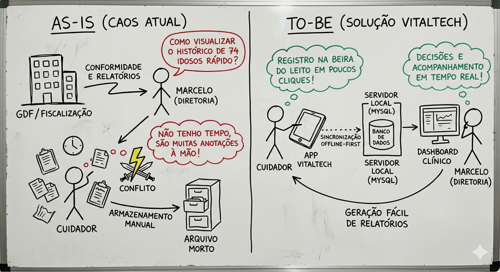
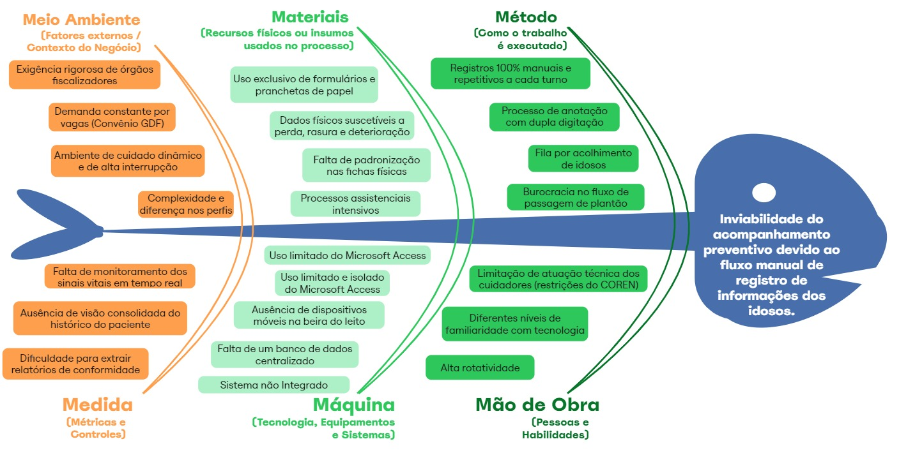
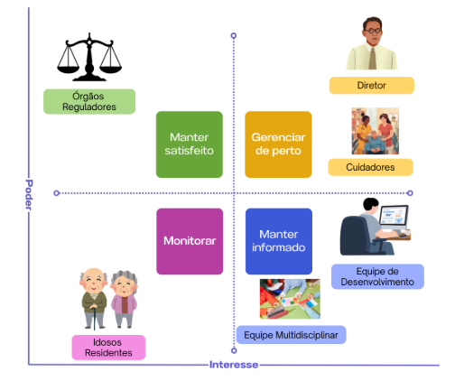

# 1. Cenário Atual do Cliente e do Negócio

## 1.1 Identificação do Cliente/Parceiro
* **Nome:** Lar dos Velhinhos Bezerra de Menezes 
* **Tipo:** Entidade Beneficente de Assistência Social
* **Local:** Sobradinho
* **Representante:** Marcelo Souza
* **Forma de contato:** Reuniões via videoconferência, email e chat de mensagens instantâneas
* **Vínculo com o projeto:** Diretor e Gestor voluntário da organização não governamental interessada, responsável por gerir e organizar a equipe de funcionários para acompanhamento de rotina dos idosos residentes e validador das decisões tomadas pelo grupo.

## 1.2 Introdução ao Negócio e Contexto
O Lar dos Velhinhos é uma instituição de cunho social dedicada ao acolhimento e cuidado contínuo de idosos na região de Brasília. É uma Instituição de Longa Permanência para Idosos (ILPI) que atua na garantia de qualidade de vida, dignidade e preservação da autonomia de idosos em situação de vulnerabilidade social. O Lar é mantido pela instituição Obras Assistenciais Bezerra de Menezes - OBEM, associação filantrópica, sem fins lucrativos, administrada por voluntários não remunerados e remunerados. Gera mais de 65 empregos diretos, entre cuidadores de idosos, pessoal de escritório, recepção, secretaria, cozinha, lavanderia, limpeza, artesanato, manutenção predial, profissionais das áreas de fisioterapia, medicina, farmácia, terapia ocupacional, musicoterapia, fonoaudiologia, nutrição, psicologia, podologia, recursos humanos, comunicação e serviço social. 

Atualmente, a instituição opera em sua capacidade máxima, abrigando 74 residentes de baixa renda que são encaminhados via convênio com o Governo do Distrito Federal (GDF). A rotina de cuidados exige a coleta e registro de sinais vitais (como pressão arterial, temperatura, glicemia, entre outros) e organiza os cuidados prestados por meio de diagnósticos, procedimentos, evolução para guiar o tratamento de forma segura e contínua diversas vezes ao dia para cada um dos residentes. 

Atualmente, esse processo de registro de saúde é feito de forma manual por meio anotações em formulário em papel e pranchetas e posteriormente é repassado para o excel também de forma manual para posterior uso em uma ferramenta de gestão de planilhas por meio do Microsoft Access. Isso, aumenta o tempo gasto empenhado pela equipe de cuidadores que gera dificuldades no armazenamento, na integração com outros sistemas de gestão do asilo e na rápida tomada de decisão por parte da equipe médica e diretoria.

## 1.3 Rich Picture

*Imagem 1. Criação Própria (Equipe Atenas).*

O diagrama ilustra o fluxo atual onde são coletados os dados dos idosos manualmente em papel, gerando gargalos de armazenamento físico e risco de perda de dados. O fluxo ideal demonstra o cuidador utilizando um aplicativo em um dispositivo móvel (tablet/smartphone) que sincroniza os dados dos sinais vitais de forma estruturada com o servidor local da instituição, permitindo que a diretoria e a equipe médica acessem o histórico integrado.

## 1.4 Identificação da Oportunidade ou Problema
Identificamos os desafios assistenciais e operacionais do Lar dos Velhinhos Bezerra de Menezes, administrado pelo diretor voluntário Marcelo Souza, que atualmente acolhe em sua capacidade máxima 74 residentes com variados graus de dependência física e cognitiva. Para garantir a segurança e a saúde desses residentes, o protocolo de cuidado exige a realização de monitoramentos diários rigorosos, que vão além dos sinais vitais (pressão arterial, glicemia, temperatura e frequência cardíaca), englobando a rotina de saúde completa, como a oferta de água, aceitação alimentar, administração de medicamentos, integridade da pele e padrão de eliminação a cada troca de fralda.

O problema central da instituição reside na inviabilidade do acompanhamento preventivo devido ao fluxo manual de registro dessas informações. Atualmente, a coleta inicial na beira do leito é realizada de forma estritamente manual por meio de pranchetas de papel. Posteriormente, exige-se um esforço de dupla digitação para que os dados sejam centralizados em um banco de dados local estruturado em Microsoft Access. Por ser uma ferramenta legado, restrita a computadores desktop e sem capacidade de operação móvel, o Access não suporta a dinâmica transacional dos cuidadores, isolando a informação no momento em que ela é mais necessária.

Essa limitação arquitetural torna a leitura retrospectiva lenta e inviabiliza o monitoramento clínico em tempo real. Sem uma centralização digital imediata, a diretoria e a equipe de saúde perdem a capacidade de agir de forma preditiva, demorando, por exemplo, a notar que um idoso não se alimentou ou não evacuou por dias sucessivos. Além disso, a alta rotatividade de cuidadores agrava o risco de erros operacionais na transcrição do papel para o computador, o que impacta diretamente a geração de relatórios de conformidade analisados pelos gestores da Instituição.

A oportunidade deste projeto concentra-se exclusivamente em resolver esse gargalo de coleta de dados. A digitalização desse processo na beira do leito por meio de um aplicativo web móvel é uma necessidade urgente para mitigar riscos de saúde, trazer dinamicidade à rotina dos cuidadores, otimizar o tempo de registro e alimentar uma base estruturada que garanta a excelência e a rastreabilidade do cuidado em tempo real.

*Imagem 2 - Diagrama de Ishikawa. Criação Própria.*

## 1.5 Desafios do Projeto
O principal desafio técnico do projeto é a transição e implementação de um modelo que substitua a rotina anterior do stakeholders, que atualmente combina registros manuais em papel com o uso do Microsoft Access, para um sistema digital mais estruturado e integrado. Essa mudança deve garantir que as informações dos idosos sejam centralizadas, organizadas e facilmente acessíveis. Também destaca-se o desafio relacionado à diversidade de cadastros existentes na instituição. O sistema deve ser capaz de organizar os diferentes tipos de informações, como cadastro de idosos, funcionários, atendimentos e registros diários, cada um com características e níveis de detalhamento distintos. 

Outro ponto a ser observado é a criação de um banco de dados relacional confiável, que possa ser acessado por meio do servidor local disponibilizado na ONG, permitindo o armazenamento seguro das informações e possibilitando consultas ao histórico dos registros, incluindo versões anteriores dos prontuários e a capacidade de realizar consultas complexas ao histórico de saúde dos pacientes (incluindo o controle de versões de prontuários anteriores). Além disso, um dos principais desafios está na usabilidade do sistema. Conforme solicitado pelo cliente, o preenchimento do prontuário deve ser realizado quase totalmente por meio de botões e opções pré-definidas, reduzindo ao máximo a necessidade de digitação. O uso de texto livre deve ser limitado a situações excepcionais, como observações fora do padrão. Isso exige um cuidado especial no design do sistema, para que as opções disponíveis consigam representar fielmente a rotina e as necessidades reais do cuidado diário.

Como também, desenvolver um sistema com curva de aprendizado próxima a zero. Devido a rotatividade de funcionários e cuidadores, o aplicativo deve ser autoexplicativo, dispensando a necessidade de treinamentos extensivos. O sistema deve ser intuitivo, de fácil aprendizado. O sistema lidará com dados médicos e informações pessoais sensíveis de idosos, exigindo a implementação de controles de acesso estritos, autenticação de cuidadores e proteção do banco de dados em conformidade com a Lei Geral de Proteção de Dados. Por fim, destaca-se também o desafio operacional relacionado ao grande volume de informações registradas diariamente, como medicação, alimentação, higiene e sinais vitais, o que exige uma solução eficiente para evitar erros, atrasos ou perda de informações.

## 1.6 Mapa de Stakeholders
Os principais stakeholders do projeto são: Marcelo Souza, como representante do cliente e principal responsável por validar prioridades, regras de negócio e a transição do sistema legado; Cuidadores, diretamente impactados pela digitalização dos processos de rotina e responsáveis pela alimentação diária de dados de saúde; Equipe Multidisciplinar (Fisioterapia, Fonoaudiologia e Assistência Social), que utilizará o sistema para registro de evoluções e consulta de prontuários digitais; Idosos Residentes, que são os beneficiários finais do monitoramento e da segurança garantida pelo software; e a Equipe de Desenvolvimento, responsável por projetar a arquitetura de dados e implementar uma solução de alta usabilidade para dispositivos móveis (tablets). Adicionalmente, figuram como stakeholders externos os Órgãos Reguladores (ANVISA/MP/GDF), que impõem requisitos de conformidade legal.

| Stakeholder | Relação com a solução | Interesse principal | Influência |
| --- | --- | --- | --- |
| **Marcelo Souza (Diretor Voluntário)** | Representante do cliente (Diretoria) | Validar escopo, regras de negócio, relatórios gerenciais e viabilizar o servidor | Alta |
| **Cuidadores / Enfermeiros** | Usuários finais diretos do App | Registro rápido de rotinas, sinais vitais. Registrar os dados de forma mais rápida, segura e com menos retrabalho. | Alta |
| **Equipe Multidisciplinar** | Usuários especialistas | Acompanhar evolução clínica e histórico de prontuários | Média |
| **Equipe de Desenvolvimento** | Desenvolvedores responsáveis pela solução do produto | Entregar uma solução viável, segura e de qualidade. | Alta |
| **Órgãos Reguladores (ANVISA/MP)** | Reguladores externos | Garantir a conformidade legal e os direitos dos idosos | Alta |
| **Idosos (74 residentes)** | Impactados pela solução | Receber cuidados de saúde mais precisos graças ao histórico digital de qualidade. | Baixa |

*Imagem 3 - Mapa dos Stakeholders. Criação Própria.*

## 1.7 Segmentação de Clientes
No que diz respeito à organização dos clientes interessados:

* **Cuidadores:** Profissionais de saúde que estão na linha de frente. Constituem o maior grupo de colaboradores da instituição, sendo responsáveis pelo cuidado diário dos idosos. Possuem, em sua maioria, formação técnica em enfermagem, embora atuem como cuidadores, e estão diretamente envolvidos na rotina assistencial dos residentes. Necessitam de um sistema rápido, com botões claros e que previna erros de digitação (ex: alertas para valores vitais absurdos).
* **Equipe multidisciplinar (fisioterapeutas, fonoaudiólogos e musicoterapeutas):** Profissionais especializados que atuam no acompanhamento terapêutico dos idosos, contribuindo para a manutenção da saúde funcional, cognitiva e social dos residentes por meio de atividades específicas.
* **Assistentes sociais:** Profissionais responsáveis pela avaliação social dos idosos, gestão do processo de acolhimento, acompanhamento da situação familiar e articulação com órgãos públicos e serviços de assistência social.
* **Equipe administrativa e gestão:** Compreende os responsáveis pela coordenação e administração da instituição, incluindo controle operacional, gestão de recursos humanos, relacionamento com órgãos públicos e tomada de decisões estratégicas. Necessitam que os dados gerados pelos usuários operacionais sejam armazenados de forma estruturada, permitindo a integração com sistemas de gestão legados.
