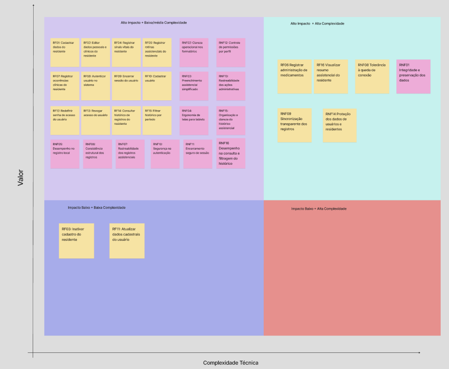

# 6. Matriz de Priorização

## Priorização de Requisitos e Escopo

Para apoiar a definição do escopo do Produto Mínimo Viável (MVP) do sistema VitalTech, a equipe utilizou uma abordagem mista, combinando análise quantitativa e qualitativa dos requisitos.

A matriz de priorização considera tanto **Requisitos Funcionais (RFs)** quanto **Requisitos Não Funcionais (RNFs)**, pois ambos influenciam diretamente a entrega de valor do produto. Os RFs representam funcionalidades executadas pelo sistema, enquanto os RNFs representam atributos de qualidade, restrições técnicas e condições de operação, como segurança, desempenho, usabilidade, rastreabilidade e confiabilidade.

Embora RFs e RNFs possuam naturezas diferentes, ambos foram avaliados a partir de dois eixos comuns: **Impacto** e **Esforço**. Dessa forma, foi possível posicioná-los em uma mesma matriz de priorização, mantendo a distinção entre os tipos de requisito.

---

## 1. Metodologia de Avaliação

A avaliação dos requisitos foi realizada utilizando uma escala de 1 a 5.

| Nota | Interpretação |
| :---: | :--- |
| 1 | Muito baixo |
| 2 | Baixo |
| 3 | Médio |
| 4 | Alto |
| 5 | Muito alto |

Para a classificação final dos valores médios, foi adotada a seguinte escala:

| Média | Classificação |
| :---: | :--- |
| 1,0 a 2,4 | Baixo |
| 2,5 a 3,4 | Médio |
| 3,5 a 5,0 | Alto |

Embora cada critério individual seja avaliado com nota inteira de 1 a 5, os valores finais de **Impacto** e **Esforço** podem apresentar casas decimais, pois são calculados pela média aritmética dos critérios avaliados.

---

## 2. Critérios para Requisitos Funcionais

Para os **Requisitos Funcionais (RFs)**, o impacto foi calculado considerando os seguintes critérios:

| Critério | Sigla | Descrição |
| :--- | :---: | :--- |
| Valor operacional | VO | Quanto o requisito ajuda na rotina da instituição. |
| Frequência de uso | FU | Com que frequência a funcionalidade tende a ser usada. |
| Criticidade assistencial | CA | Quanto o requisito se relaciona com o cuidado ao residente. |
| Dependência funcional | DF | Quanto outros requisitos dependem dele. |
| Alinhamento ao MVP | AM | Quanto o requisito é necessário para validar a primeira versão do produto. |

A fórmula utilizada para o impacto dos RFs foi:

$$
Impacto\ RF = \frac{VO + FU + CA + DF + AM}{5}
$$

Para o esforço dos RFs, foram considerados os seguintes critérios:

| Critério | Sigla | Descrição |
| :--- | :---: | :--- |
| Complexidade técnica | CT | Dificuldade de implementação da funcionalidade. |
| Quantidade de telas ou fluxos | QT | Número de interfaces ou fluxos afetados. |
| Regras de negócio | RN | Quantidade de validações e exceções envolvidas. |
| Dependência de módulos | DM | Relação com outras partes do sistema. |
| Necessidade de testes | NT | Quantidade de cenários necessários para validar a funcionalidade. |

A fórmula utilizada para o esforço dos RFs foi:

$$
Esforço\ RF = \frac{CT + QT + RN + DM + NT}{5}
$$

---

## 3. Critérios para Requisitos Não Funcionais

Para os **Requisitos Não Funcionais (RNFs)**, o impacto foi calculado considerando os seguintes critérios:

| Critério | Sigla | Descrição |
| :--- | :---: | :--- |
| Risco operacional | RO | Risco gerado caso o requisito não seja atendido. |
| Impacto na segurança/confiabilidade | SC | Relação com proteção, integridade e continuidade do uso. |
| Impacto na usabilidade | US | Quanto o requisito afeta a facilidade de uso. |
| Criticidade para o MVP | CM | Quanto o requisito é necessário para validar o produto inicial. |
| Verificabilidade | VF | Facilidade de demonstrar, testar ou evidenciar o requisito. |

A fórmula utilizada para o impacto dos RNFs foi:

$$
Impacto\ RNF = \frac{RO + SC + US + CM + VF}{5}
$$

Para o esforço dos RNFs, foram considerados os seguintes critérios:

| Critério | Sigla | Descrição |
| :--- | :---: | :--- |
| Dificuldade técnica | DT | Dificuldade de implementar o requisito. |
| Impacto arquitetural | IA | Quanto o requisito afeta a estrutura do sistema. |
| Dependência de infraestrutura | INF | Necessidade de conexão, armazenamento local, autenticação ou sincronização. |
| Necessidade de medição/testes | NT | Necessidade de validar desempenho, segurança ou confiabilidade. |
| Abrangência no sistema | ABR | Quantas partes do sistema são afetadas pelo requisito. |

A fórmula utilizada para o esforço dos RNFs foi:

$$
Esforço\ RNF = \frac{DT + IA + INF + NT + ABR}{5}
$$

---

## 4. Cálculo do Índice de Prioridade

A equipe utilizou o **Índice de Prioridade (IP)** para apoiar a comparação entre os requisitos. O cálculo adotado foi:

$$
IP = (2 \times I) - E
$$

Onde:

| Sigla | Significado |
| :---: | :--- |
| IP | Índice de Prioridade |
| I | Impacto |
| E | Esforço |

O impacto recebeu peso 2 porque, para a definição do MVP, o valor entregue ao cliente deve ter maior relevância do que o esforço técnico. O esforço, por sua vez, atua como fator de redução da prioridade, pois requisitos mais complexos exigem maior planejamento, validação e tempo de implementação.

Exemplo de cálculo para um requisito de alto impacto e baixo esforço:

$$
IP = (2 \times 5) - 2
$$

$$
IP = 10 - 2 = 8
$$

Nesse caso, o requisito possui alta prioridade, pois entrega muito valor e exige esforço relativamente baixo.

Exemplo de cálculo para um requisito de alto impacto e alto esforço:

$$
IP = (2 \times 5) - 5
$$

$$
IP = 10 - 5 = 5
$$

Nesse caso, o requisito continua sendo importante, mas exige maior planejamento por possuir alto esforço.

---

## 5. Classificação dos Requisitos

A classificação dos requisitos foi realizada a partir da relação entre **Impacto** e **Esforço**.

| Impacto | Esforço | Classificação | Decisão |
| :---: | :---: | :--- | :--- |
| Alto | Baixo | Prioridade imediata | Entra no MVP |
| Alto | Médio | Prioridade planejada | Entra no MVP, com planejamento |
| Alto | Alto | Essencial complexa | Entra no MVP apenas se for indispensável |
| Médio | Baixo | Incremento rápido | Pode entrar em sprint posterior |
| Médio | Médio | Incremento planejado | Fica após o MVP |
| Médio/Baixo | Alto | Baixa prioridade | Fica fora do MVP inicial |

A matriz visual foi interpretada a partir da relação entre impacto e esforço/complexidade técnica. Assim, o **IP** foi utilizado como apoio quantitativo, enquanto a matriz permite visualizar a posição estratégica de cada requisito no escopo do produto.

---

## 6. Matriz de Valor x Complexidade Técnica

A matriz abaixo apresenta a distribuição visual dos Requisitos Funcionais e Não Funcionais do VitalTech, considerando o impacto de cada requisito para o produto e o esforço necessário para sua implementação.

---

## 7. Cálculo dos Requisitos Funcionais

| Código | Requisito Funcional | Impacto | Esforço | Cálculo do IP | IP | Classificação | MVP |
| :--- | :--- | :---: | :---: | :--- | :---: | :--- | :---: |
| **RF01** | Cadastrar dados do residente | 5,0 | 2,4 | (2 × 5,0) - 2,4 | **7,6** | Prioridade imediata | Sim |
| **RF02** | Editar dados pessoais e clínicos do residente | 4,0 | 2,6 | (2 × 4,0) - 2,6 | **5,4** | Prioridade planejada | Sim |
| **RF03** | Inativar o cadastro do residente | 3,0 | 1,8 | (2 × 3,0) - 1,8 | **4,2** | Incremento rápido | Não |
| **RF04** | Registrar sinais vitais do residente | 5,0 | 3,0 | (2 × 5,0) - 3,0 | **7,0** | Prioridade planejada | Sim |
| **RF05** | Registrar rotinas assistenciais do residente | 4,8 | 3,0 | (2 × 4,8) - 3,0 | **6,6** | Prioridade planejada | Sim |
| **RF06** | Registrar administração de medicamentos | 5,0 | 3,6 | (2 × 5,0) - 3,6 | **6,4** | Essencial complexa | Sim, em versão mínima |
| **RF07** | Registrar ocorrências clínicas do residente | 4,7 | 3,0 | (2 × 4,7) - 3,0 | **6,4** | Prioridade planejada | Sim |
| **RF08** | Autenticar usuário no sistema | 5,0 | 2,3 | (2 × 5,0) - 2,3 | **7,7** | Prioridade imediata | Sim |
| **RF09** | Encerrar sessão do usuário | 3,8 | 1,5 | (2 × 3,8) - 1,5 | **6,1** | Prioridade imediata | Sim |
| **RF10** | Cadastrar usuário | 4,2 | 2,8 | (2 × 4,2) - 2,8 | **5,6** | Prioridade planejada | Sim |
| **RF11** | Atualizar dados cadastrais do usuário | 3,1 | 2,2 | (2 × 3,1) - 2,2 | **4,0** | Incremento rápido | Não |
| **RF12** | Redefinir senha de acesso do usuário | 3,7 | 2,5 | (2 × 3,7) - 2,5 | **4,9** | Prioridade planejada | Não obrigatório |
| **RF13** | Revogar acesso do usuário | 4,3 | 2,3 | (2 × 4,3) - 2,3 | **6,3** | Prioridade imediata | Sim |
| **RF14** | Consultar histórico de registros do residente | 5,0 | 3,4 | (2 × 5,0) - 3,4 | **6,6** | Prioridade planejada | Sim |
| **RF15** | Filtrar histórico por período | 4,1 | 2,5 | (2 × 4,1) - 2,5 | **5,7** | Prioridade planejada | Sim |
| **RF16** | Visualizar resumo assistencial do residente | 4,0 | 3,5 | (2 × 4,0) - 3,5 | **4,5** | Essencial complexa | Não |

---

## 8. Cálculo dos Requisitos Não Funcionais

| Código | Requisito Não Funcional | Impacto | Esforço | Cálculo do IP | IP | Classificação | MVP |
| :--- | :--- | :---: | :---: | :--- | :---: | :--- | :---: |
| **RNF01** | Integridade e preservação dos dados | 5,0 | 3,8 | (2 × 5,0) - 3,8 | **6,2** | Essencial complexa | Sim |
| **RNF02** | Clareza ocupacional nos formulários | 4,5 | 2,0 | (2 × 4,5) - 2,0 | **7,0** | Prioridade imediata | Sim |
| **RNF03** | Interface poupadora de cliques | 4,4 | 2,2 | (2 × 4,4) - 2,2 | **6,6** | Prioridade imediata | Sim |
| **RNF04** | Ergonomia de tela para tablets | 4,5 | 2,6 | (2 × 4,5) - 2,6 | **6,4** | Prioridade planejada | Sim |
| **RNF05** | Desempenho no registro local | 4,8 | 3,0 | (2 × 4,8) - 3,0 | **6,6** | Prioridade planejada | Sim |
| **RNF06** | Consistência estrutural do registro | 4,6 | 2,7 | (2 × 4,6) - 2,7 | **6,5** | Prioridade planejada | Sim |
| **RNF07** | Rastreabilidade dos registros assistenciais | 5,0 | 3,2 | (2 × 5,0) - 3,2 | **6,8** | Prioridade planejada | Sim |
| **RNF08** | Tolerância à queda de conexão | 5,0 | 4,4 | (2 × 5,0) - 4,4 | **5,6** | Essencial complexa | Sim, se indispensável |
| **RNF09** | Sincronização inteligente e transparente | 4,8 | 4,5 | (2 × 4,8) - 4,5 | **5,1** | Essencial complexa | Sim, se indispensável |
| **RNF10** | Segurança na autenticação | 5,0 | 2,8 | (2 × 5,0) - 2,8 | **7,2** | Prioridade planejada | Sim |
| **RNF11** | Encerramento seguro de sessão | 4,2 | 2,0 | (2 × 4,2) - 2,0 | **6,4** | Prioridade imediata | Sim |
| **RNF12** | Controle de permissões por perfil | 5,0 | 3,2 | (2 × 5,0) - 3,2 | **6,8** | Prioridade planejada | Sim |
| **RNF13** | Rastreabilidade das ações administrativas | 4,0 | 3,0 | (2 × 4,0) - 3,0 | **5,0** | Prioridade planejada | Sim |
| **RNF14** | Proteção dos dados de usuários e residentes | 5,0 | 4,0 | (2 × 5,0) - 4,0 | **6,0** | Essencial complexa | Sim |
| **RNF15** | Organização e clareza do histórico assistencial | 4,6 | 2,6 | (2 × 4,6) - 2,6 | **6,6** | Prioridade planejada | Sim |
| **RNF16** | Desempenho na consulta e filtragem do histórico | 4,5 | 3,0 | (2 × 4,5) - 3,0 | **6,0** | Prioridade planejada | Sim |

---

## 9. Análise dos Resultados

A análise quantitativa indica que os requisitos com maior Índice de Prioridade são aqueles que combinam alto impacto com menor esforço relativo. Entre eles, destacam-se **RF08 — Autenticar usuário no sistema**, **RF01 — Cadastrar dados do residente**, **RF04 — Registrar sinais vitais do residente**, **RNF10 — Segurança na autenticação**, **RNF02 — Clareza ocupacional nos formulários** e **RNF07 — Rastreabilidade dos registros assistenciais**.

Também foram identificados requisitos de alto impacto e maior esforço técnico, como **RF06 — Registrar administração de medicamentos**, **RF16 — Visualizar resumo assistencial do residente**, **RNF01 — Integridade e preservação dos dados**, **RNF08 — Tolerância à queda de conexão**, **RNF09 — Sincronização inteligente e transparente** e **RNF14 — Proteção dos dados de usuários e residentes**. Esses requisitos são relevantes para o produto, mas demandam maior planejamento por envolverem segurança, confiabilidade, proteção de dados, operação offline, sincronização ou composição de informações.

Os requisitos classificados como incremento rápido, como **RF03 — Inativar o cadastro do residente** e **RF11 — Atualizar dados cadastrais do usuário**, apresentam menor impacto relativo na validação inicial do produto, apesar de possuírem baixa complexidade.

A matriz visual complementa a análise quantitativa ao permitir observar a distribuição dos requisitos entre os grupos de maior impacto, maior complexidade e menor urgência. Dessa forma, a priorização não depende apenas do Índice de Prioridade, mas também da interpretação estratégica da equipe sobre dependências, riscos e valor entregue ao usuário.

---

## 10. Relação com o MVP

A matriz de priorização será utilizada como apoio para a definição do Produto Mínimo Viável do VitalTech. A seleção do MVP deve considerar os requisitos com maior impacto para a rotina da instituição, sem ignorar requisitos de maior esforço que sejam indispensáveis para a segurança, confiabilidade e rastreabilidade do sistema.

Assim, o MVP não deve ser definido apenas pelos itens de menor esforço, mas pelo menor conjunto de RFs e RNFs capaz de validar a proposta central do produto: permitir o registro assistencial digital de residentes, com controle de acesso, rastreabilidade, consulta histórica e confiabilidade operacional.

A jornada mínima considerada para o MVP envolve:

1. autenticar o usuário;
2. cadastrar ou selecionar um residente;
3. registrar informações assistenciais essenciais;
4. salvar registros com data, horário e autoria;
5. consultar o histórico assistencial do residente;
6. manter segurança, rastreabilidade e confiabilidade mínima dos registros.

---

## Histórico de Revisão

| Data | Versão | Descrição | Autor |
| :---: | :---: | --- | --- |
| 18/05/2026 | 1.0 | Criação da matriz de priorização com critérios de impacto, esforço, cálculo do Índice de Prioridade e alocação visual dos RFs e RNFs. | Gustavo Xavier |