# Wireframes e Protótipo de Alta Fidelidade

## Introdução

Este documento apresenta a evolução visual da solução VitalTech a partir dos wireframes apresentados pelo cliente e, posteriormente, do protótipo de alta fidelidade validado.

A documentação dos protótipos tem como objetivo registrar visualmente a interpretação dos requisitos levantados, permitindo verificar se a solução proposta está alinhada às necessidades do cliente e ao fluxo esperado de uso do sistema.

---

## Wireframes apresentados pelo cliente

Os wireframes apresentados pelo cliente representam uma visão inicial da organização das telas, dos principais elementos de interface e dos fluxos esperados para o sistema.
Eles serviram como base para compreender a estrutura desejada da solução e orientar a construção do protótipo de alta fidelidade.

### Tela 1

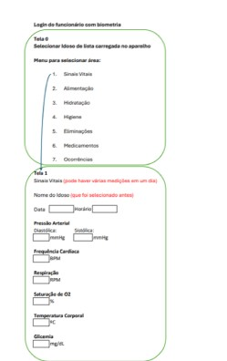

### Tela 2

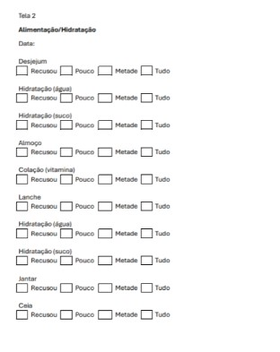

### Tela 3

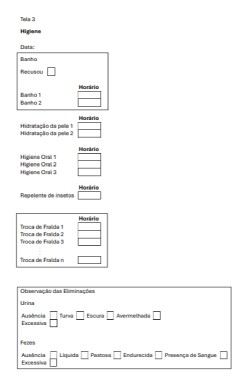

### Tela 4

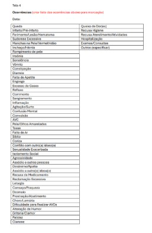

---

## Protótipo de alta fidelidade validado pelo cliente

Após a análise dos wireframes e dos requisitos levantados, foi elaborado um protótipo de alta fidelidade com maior detalhamento visual, organização dos componentes e representação mais próxima da interface final esperada para o sistema.

O protótipo foi validado com o cliente, permitindo confirmar a aderência da proposta às necessidades identificadas durante o processo de Engenharia de Requisitos.

A apresentação interna está registrada na [Review da Sprint 1](../sprints/sprint1/review.md), enquanto a validação posterior com o cliente consta na [Ata de Reunião 06 da Sprint 1](../sprints/sprint1/dailys.md).

### Tela inicial

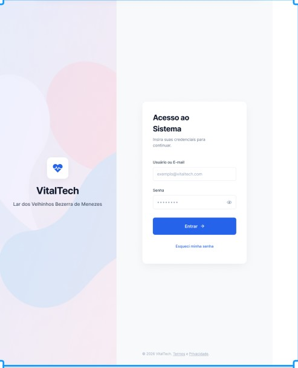

### Tela administrativa

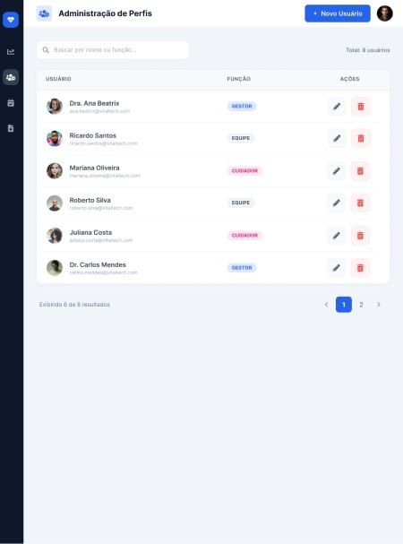

### Painel de residentes

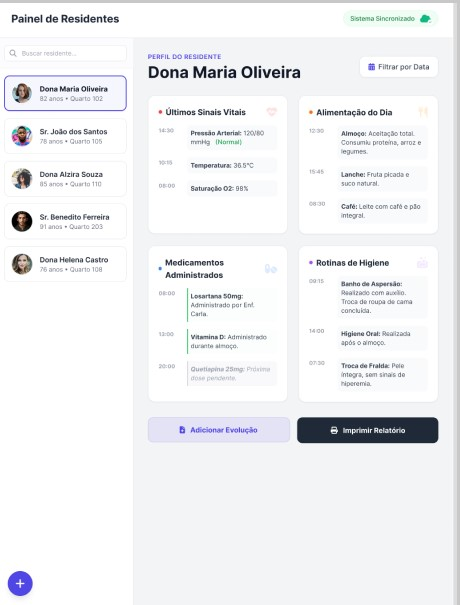

### Registros

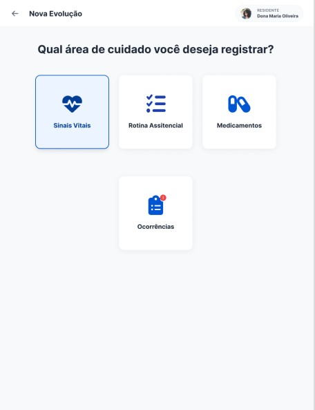

### Registro de sinais vitais

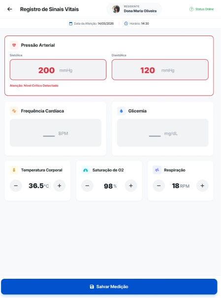

### Rotina assistencial

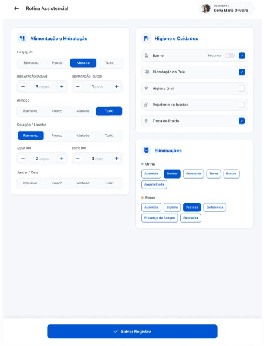

### Medicamentos

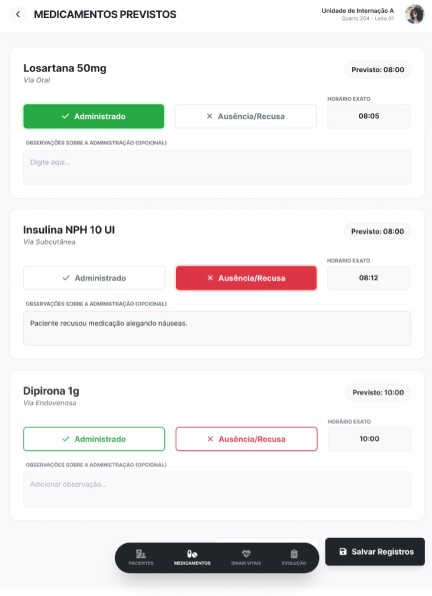

### Feedback de sucesso

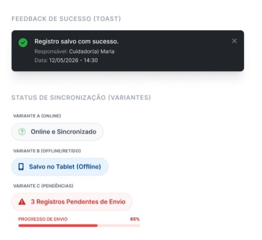

---

<iframe style="border: 1px solid rgba(0, 0, 0, 0.1);" width="700" height="450" src="https://embed.figma.com/design/9DQ56Q1rwoL9GsRLkPTCDi/Untitled?node-id=0-1&embed-host=share" allowfullscreen></iframe>

## Histórico de Revisão

| Data | Versão | Descrição | Autor |
| :---: | :---: | --- | --- |
| 18/05/2026 | 1.0 | Inclusão dos wireframes apresentados pelo cliente e do protótipo de alta fidelidade validado. | Enzo Menali |

