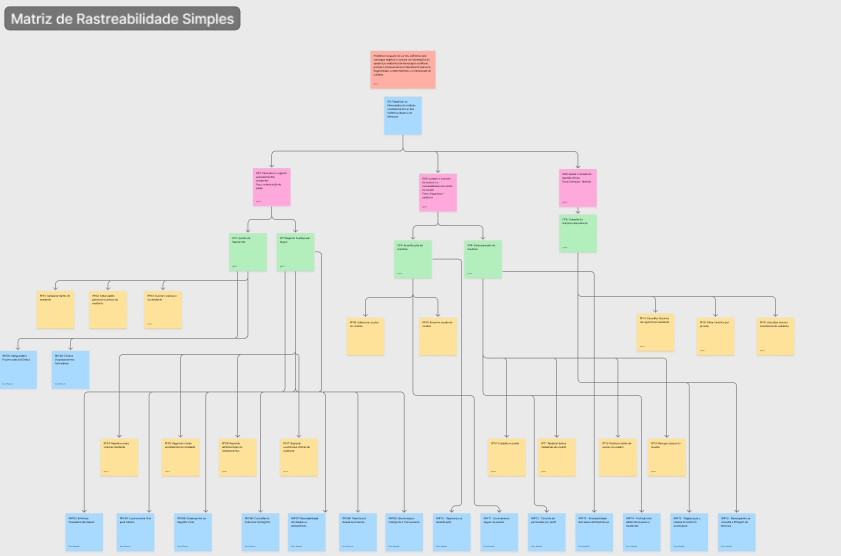

# REQUISITOS DE SOFTWARE

## VitalTech — Requisitos Funcionais e Não Funcionais

Este documento consolida a lista de requisitos funcionais e não funcionais do VitalTech, além de sua matriz de rastreabilidade com as Características do Produto (CP). Os requisitos funcionais são apresentados no formato verbo no infinitivo + objeto. Os requisitos não funcionais incluem nome, descrição técnica e classificação segundo os modelos URPS+ e/ou Sommerville.

---

## 1. Relação de Requisitos Funcionais (RFs) com as Características do Produto (CP)

A tabela abaixo apresenta os requisitos funcionais do VitalTech. Cada RF deriva de exatamente uma Característica do Produto (CP) e representa uma ação realizada pelo usuário.

| Código | Requisito | CP | Justificativa |
| :--- | :--- | :--- | :--- |
| **RF01** | Cadastrar dados do residente | CP1 | Cria o perfil digital do residente, substituindo a ficha em papel. |
| **RF02** | Editar dados pessoais e clínicos do residente | CP1 | Atualiza informações do residente conforme necessidade clínica ou administrativa. |
| **RF03** | Inativar o cadastro do residente | CP1 | Remove o residente do fluxo operacional ativo sem excluir o histórico (soft delete). |
| **RF04** | Registrar, editar e consultar sinais vitais do residente | CP2 | Digitaliza a aferição periódica e a consulta clínica no ponto de cuidado. |
| **RF05** | Registrar, editar e consultar rotinas assistenciais do residente | CP2 | Documenta e permite revisão da alimentação e higiene do residente. |
| **RF06** | Registrar, editar e consultar administração de medicamentos | CP2 | Documenta e permite conferir a medicação efetivamente administrada no turno. |
| **RF07** | Registrar, editar e consultar ocorrências clínicas do residente | CP2 | Registra e permite consulta de eventos e intercorrências observados durante o cuidado. |
| **RF08** | Autenticar usuário no sistema | CP3 | Controla o acesso ao sistema por meio de credenciais individuais. |
| **RF09** | Encerrar sessão do usuário | CP3 | Garante a segurança do dispositivo compartilhado após o uso. |
| **RF10** | Cadastrar usuário | CP4 | Permite ao gestor incluir novos membros da equipe no sistema. |
| **RF11** | Atualizar dados cadastrais do usuário | CP4 | Mantém as informações da equipe atualizadas. |
| **RF12** | Redefinir senha de acesso do usuário | CP4 | Permite ao gestor restaurar o acesso de um usuário que esqueceu a senha. |
| **RF13** | Revogar acesso do usuário | CP4 | Bloqueia o acesso ao sistema em casos de desligamento da equipe. |
| **RF14** | Consultar histórico de registros do residente | CP5 | Permite à equipe visualizar a evolução clínica cronológica do residente. |
| **RF15** | Filtrar histórico por período | CP5 | Facilita a busca de registros em intervalos de tempo específicos. |
| **RF16** | Visualizar resumo assistencial do residente | CP5 | Exibe visão consolidada do estado atual e recente do residente para apoio à decisão. |

---

## 2. Regras de Negócio (RNs)

As regras de negócio definem restrições e comportamentos impostos pelo contexto operacional e legal da instituição, independentemente de ação direta do usuário.

| Código | Regra de Negócio | Fundamento |
| :--- | :--- | :--- |
| **RN-01** | Todo registro assistencial deve poder ser realizado independentemente da disponibilidade de conexão com o servidor, sendo sincronizado automaticamente quando a conexão for restabelecida. | Infraestrutura de rede instável da instituição |
| **RN-02** | Todo registro assistencial inserido em qualquer dispositivo da equipe deve ser consolidado em um único repositório de dados institucional, garantindo que a informação esteja disponível a todos os perfis autorizados e eliminando silos de informação. | Eliminação do retrabalho de dupla digitação |
| **RN-03** | O histórico assistencial de um residente inativado não pode ser excluído do sistema. Todos os registros de saúde devem ser preservados por no mínimo 20 anos após a data do último atendimento, em conformidade com a Resolução CFM nº 1.821/2007 e com os requisitos de retenção de dados sensíveis estabelecidos pela LGPD (Lei nº 13.709/2018, Art. 11 e 16). | Obrigação legal |
| **RN-04** | A ocorrência de queda com lesão ou tentativa de suicídio de um residente deve ser registrada no sistema com data, horário e responsável pelo lançamento, em conformidade com o item 6.2 da RDC ANVISA nº 283/2005, para subsidiar a notificação obrigatória à autoridade sanitária local. | RDC ANVISA 283/2005, Art. 6.2 |
| **RN-05** | Nenhum formulário de registro assistencial pode ser submetido com campos obrigatórios em branco. O sistema deve impedir o salvamento e indicar ao usuário quais campos precisam ser preenchidos. | Integridade dos dados e padronização dos registros |
| **RN-06** | Os valores inseridos nas aferições de sinais vitais devem ser validados contra intervalos clínicos de referência (ex.: PA sistólica entre 60–250 mmHg; temperatura entre 34–42°C; glicemia entre 20–600 mg/dL). Valores fora desses limites não podem ser salvos sem confirmação explícita do usuário. | Prevenção de erros de digitação clínica |
| **RN-07** | Quando os valores registrados de sinais vitais estiverem fora dos parâmetros clínicos normais, o sistema deve sinalizar o registro com alerta visual, indicando a necessidade de avaliação pela equipe responsável. | Segurança clínica e apoio à tomada de decisão |
| **RN-08** | Todo registro de administração de medicamento deve incluir o horário exato de administração e não pode ser salvo sem essa informação, garantindo o rastreamento preciso de dosagens e dos intervalos entre administrações. | Controle de dosagem e segurança farmacológica |
| **RN-09** | Após o salvamento de qualquer registro assistencial, o sistema deve exibir confirmação visual ao usuário informando que os dados foram persistidos com sucesso, garantindo ciência do cuidador antes de prosseguir para o próximo atendimento. | Confiabilidade operacional em ambiente de alta rotatividade |

---
## 3. Lista de Requisitos Não Funcionais (RNFs) com as Características de Produto(CP)

Os requisitos não funcionais definem restrições, atributos de qualidade e critérios mensuráveis que orientam o comportamento do sistema VitalTech. Cada RNF está associado a exatamente uma Característica de Produto (CP), conforme a matriz de rastreabilidade do projeto, e foi classificado com base nos modelos URPS+ e/ou Sommerville.

| Código | Nome do Requisito (RNF) | Descrição Mensurável | Característica de Produto Associada | Classificação (URPS+ / Sommerville) |
| :--- | :--- | :--- | :--- | :--- |
| **RNF01** | Integridade e preservação dos dados | Os registros assistenciais devem manter vínculo com o residente correto, sem perda, duplicidade ou quebra de referência entre cadastro e histórico. | **CP1** | Confiabilidade / Produto |
| **RNF02** | Clareza ocupacional nos formulários | Os formulários de cadastro e atualização de residentes devem utilizar rótulos, campos e mensagens compatíveis com o vocabulário utilizado pela equipe da instituição, sendo validados por inspeção com representantes dos usuários. | **CP1** | Usabilidade / Produto|
| **RNF03** | Interface poupadora de cliques | Os fluxos principais de registro assistencial devem priorizar botões, seletores e campos pré-definidos, limitando o uso de campos de texto livre a situações em que não houver opção padronizada aplicável. | **CP2** | Usabilidade / Usabilidade |
| **RNF04** | Ergonomia de tela para tablets | A interface dos registros assistenciais deve ser adequada ao uso em tablets, com componentes interativos de tamanho mínimo de 44x44 px e espaçamento suficiente para reduzir acionamentos incorretos por toque. | **CP2** | Usabilidade / Usabilidade |
| **RNF05** | Desempenho no registro local | O tempo entre o acionamento da opção de salvar e a persistência local do registro assistencial não deve ultrapassar 1 segundo em condições normais de uso do dispositivo. | **CP2** | Desempenho / Eficiência |
| **RNF06** | Consistência estrutural do registro | Todos os registros assistenciais do produto devem seguir estrutura padronizada, contendo obrigatoriamente residente associado, tipo de registro, data, horário e responsável pelo lançamento. | **CP2** | Confiabilidade / Organização |
| **RNF07** | Rastreabilidade dos registros assistenciais | Todo registro assistencial deve armazenar automaticamente autoria, data e horário de criação, sem permitir alteração desses metadados pela interface do usuário. | **CP2** | Segurança (+) / Segurança |
| **RNF08** | Tolerância à queda de conexão | Em caso de perda de conexão durante o uso, o sistema deve preservar os dados já preenchidos e permitir a continuidade do registro assistencial em modo local, sem exigir reinício do preenchimento. | **CP2** | Confiabilidade / Disponibilidade |
| **RNF09** | Transparência da sincronização | Os registros locais devem apresentar um dos estados: salvo localmente, pendente de sincronização ou sincronizado; a atualização visual do estado deve ocorrer em até 3 segundos após mudança de conectividade. | **CP2** | Confiabilidade / Confiabilidade |
| **RNF10** | Segurança na autenticação | As tentativas de acesso com credenciais inválidas ou sessão ausente devem ser rejeitadas; mensagens de erro não devem revelar se o login, senha ou perfil foi o campo inválido. | **CP3** | Segurança (+) / Segurança |
| **RNF11** | Segurança de sessão em dispositivo compartilhado | O usuário deve ser desconectado após no máximo 15 minutos de inatividade; após encerramento manual ou automático, dados de sessão não devem permanecer acessíveis ao próximo usuário do dispositivo. | **CP3** | Segurança (+) / Segurança |
| **RNF12** | Controle de permissões por perfil | As funcionalidades e dados restritos do sistema devem ficar indisponíveis para perfis não autorizados e disponíveis apenas para perfis com permissão correspondente. | **CP4** | Segurança (+) / Segurança |
| **RNF13** | Rastreabilidade das ações administrativas | Ações administrativas relacionadas a usuários, permissões e acessos devem registrar automaticamente responsável, data, horário e tipo de ação realizada. | **CP4** | Segurança (+) / Segurança |
| **RNF14** | Confidencialidade dos dados de usuários e residentes | Campos pessoais, clínicos e administrativos do sistema classificados como sensíveis devem ser exibidos somente a usuários autorizados. | **CP4** | Segurança (+) / Segurança |
| **RNF15** | Legibilidade do histórico assistencial | Cada item do histórico assistencial deve apresentar tipo de registro, data, horário e responsável em formato que permita identificar essas quatro informações em até 5 segundos por registro. | **CP5** | Usabilidade / Usabilidade |
| **RNF16** | Desempenho na consulta e filtragem do histórico | A consulta ao histórico assistencial deve retornar os registros em até 3 segundos em rede estável, considerando uma base operacional de até 74 residentes ativos. A aplicação de filtros sobre registros já carregados deve ocorrer em até 1 segundo. | **CP5** | Desempenho / Eficiência |
---

## 4. Matriz de Rastreabilidade Simples

## Histórico de Revisão

| Data | Versão | Descrição | Autor |
| :---: | :---: | --- | --- |
| 03/04/2026 | 1.0 | Criação deste documento. | Gustavo Xavier |
| 17/05/2026 | 1.1 | Reestruturação completa: redução de 30 para 16 RFs, adição das RNs (RN-01 a RN-04). | Gustavo Xavier |
| 17/05/2026 | 1.2 | Adição de RN-05 a RN-09, convertidas de RFs antigos conforme feedback do professor. | Gustavo Xavier |
| 18/05/2026 | 1.3 | Adição de RNFS | Enzo Menali |
| 04/06/2026 | 1.4 | Ajuste nos RNFs apontados em feedback para reforçar atributos de qualidade mensuráveis e evitar escrita como regras de negócio. | Enzo Menali |
